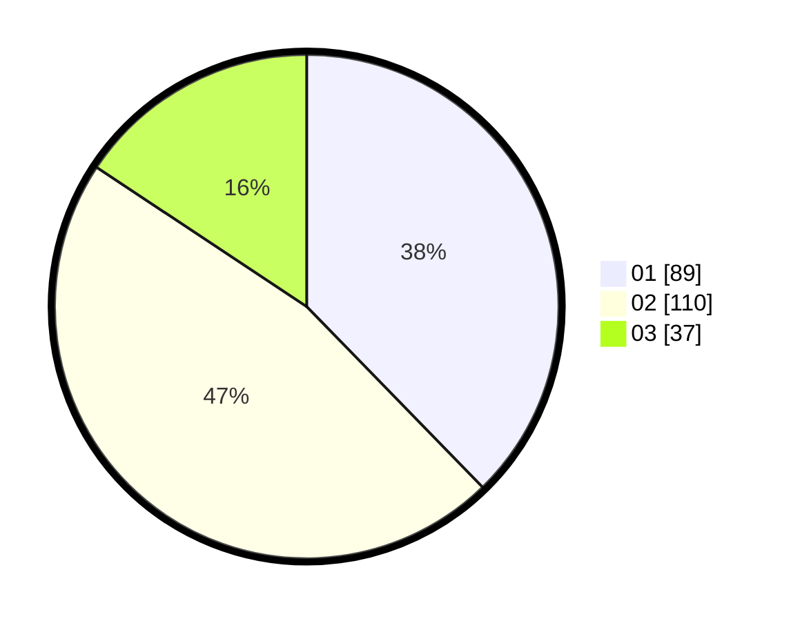

# Hasil

Hasil perolehan suara paslon dapat dilihat pada file paslon-01.txt, paslon-02.txt, dan paslon-03.txt.

Jika tidak ada, artinya data tersebut belum ada pada SIREKAP.

## Perolehan Suara

 * Paslon 01: **89**.
 * Paslon 02: **110**.
 * Paslon 03: **37**.

## Foto C Plano

https://sirekap-obj-formc.kpu.go.id/d32d/pemilu/ppwp/31/73/06/10/03/3173061003150-20240214-194202--59180a85-ac0d-4293-bc9b-b55d2a8e7cb2.jpg

https://sirekap-obj-formc.kpu.go.id/d32d/pemilu/ppwp/31/73/06/10/03/3173061003150-20240214-194320--e3b81b1b-3174-4b4a-8d96-cf93e8dbbd0f.jpg

https://sirekap-obj-formc.kpu.go.id/d32d/pemilu/ppwp/31/73/06/10/03/3173061003150-20240214-194326--550622c9-6b68-444d-a9b8-3392836f33bb.jpg

## DATA PEMILIH TETAP

Jumlah pemilih dalam DPT: **264**.
 * L: **129**.
 * P: **135**.

## DATA PENGGUNA HAK PILIH

Jumlah pengguna hak pilih dalam DPT: **228**.
 * L: **110**.
 * P: **118**.

Jumlah pengguna hak pilih dalam DPTb: **7**.
 * L: **3**.
 * P: **4**.

Jumlah pengguna hak pilih dalam DPK: **5**.
 * L: **2**.
 * P: **3**.

Jumlah pengguna hak pilih: **240**.
 * L: **115**.
 * P: **125**.

## JUMLAH SUARA SAH DAN TIDAK SAH

JUMLAH SELURUH SUARA SAH: **236**.

JUMLAH SUARA TIDAK SAH: **4**.

JUMLAH SELURUH SUARA SAH DAN SUARA TIDAK SAH: **240**.
