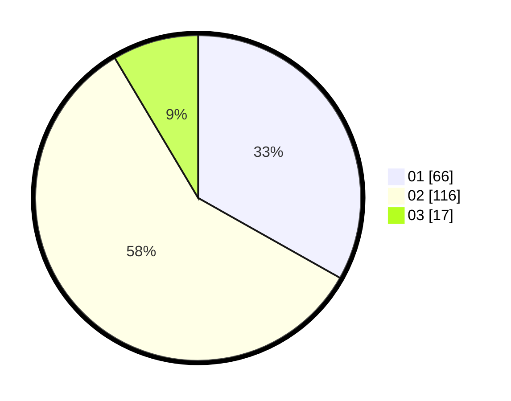

# Hasil

Hasil perolehan suara paslon dapat dilihat pada file paslon-01.txt, paslon-02.txt, dan paslon-03.txt.

Jika tidak ada, artinya data tersebut belum ada pada SIREKAP.

## Perolehan Suara

 * Paslon 01: **66**.
 * Paslon 02: **116**.
 * Paslon 03: **17**.

## Foto C Plano

https://sirekap-obj-formc.kpu.go.id/2837/pemilu/ppwp/31/73/06/10/03/3173061003151-20240216-151307--d165cd83-8fa2-40ce-a7b0-e63a15d755c9.jpg

https://sirekap-obj-formc.kpu.go.id/2837/pemilu/ppwp/31/73/06/10/03/3173061003151-20240216-151308--2a96a0ba-a307-43a9-a1b0-bb3a778a1377.jpg

https://sirekap-obj-formc.kpu.go.id/2837/pemilu/ppwp/31/73/06/10/03/3173061003151-20240216-151307--1cd918ee-7d4f-492c-a028-3b65d8b58b87.jpg

## DATA PEMILIH TETAP

Jumlah pemilih dalam DPT: **0**.
 * L: **0**.
 * P: **0**.

## DATA PENGGUNA HAK PILIH

Jumlah pengguna hak pilih dalam DPT: **0**.
 * L: **0**.
 * P: **0**.

Jumlah pengguna hak pilih dalam DPTb: **0**.
 * L: **0**.
 * P: **0**.

Jumlah pengguna hak pilih dalam DPK: **0**.
 * L: **0**.
 * P: **0**.

Jumlah pengguna hak pilih: **0**.
 * L: **0**.
 * P: **0**.

## JUMLAH SUARA SAH DAN TIDAK SAH

JUMLAH SELURUH SUARA SAH: **199**.

JUMLAH SUARA TIDAK SAH: **5**.

JUMLAH SELURUH SUARA SAH DAN SUARA TIDAK SAH: **204**.
