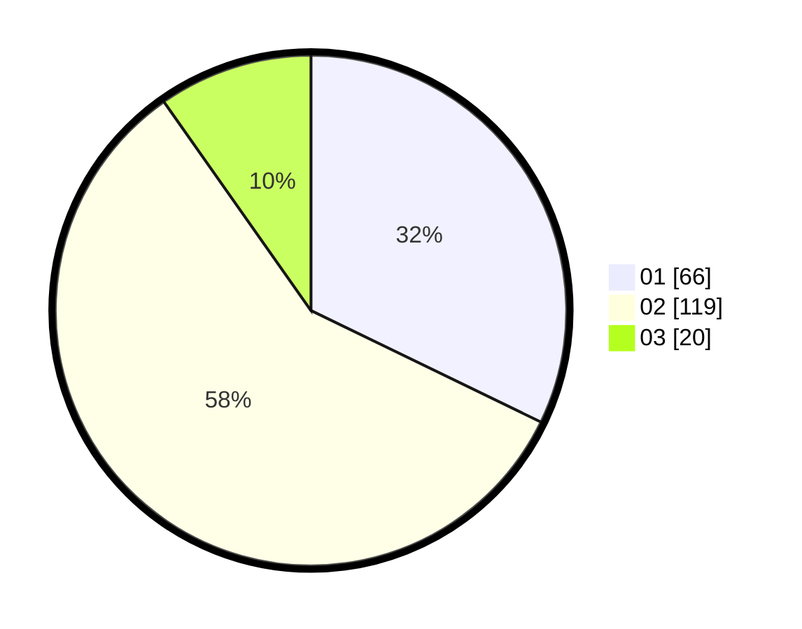

# Hasil

Hasil perolehan suara paslon dapat dilihat pada file paslon-01.txt, paslon-02.txt, dan paslon-03.txt.

Jika tidak ada, artinya data tersebut belum ada pada SIREKAP.

## Perolehan Suara

 * Paslon 01: **66**.
 * Paslon 02: **119**.
 * Paslon 03: **20**.

## Foto C Plano

https://sirekap-obj-formc.kpu.go.id/8fd1/pemilu/ppwp/31/73/06/10/03/3173061003153-20240215-003716--447f6af4-1f5b-4848-a275-b4e7168fba0a.jpg

https://sirekap-obj-formc.kpu.go.id/8fd1/pemilu/ppwp/31/73/06/10/03/3173061003153-20240215-004021--2d9215a2-ab5c-4938-9734-417338dbd7d8.jpg

https://sirekap-obj-formc.kpu.go.id/8fd1/pemilu/ppwp/31/73/06/10/03/3173061003153-20240215-003815--9aabac27-1b14-441c-a5ed-e518ececd2f8.jpg
