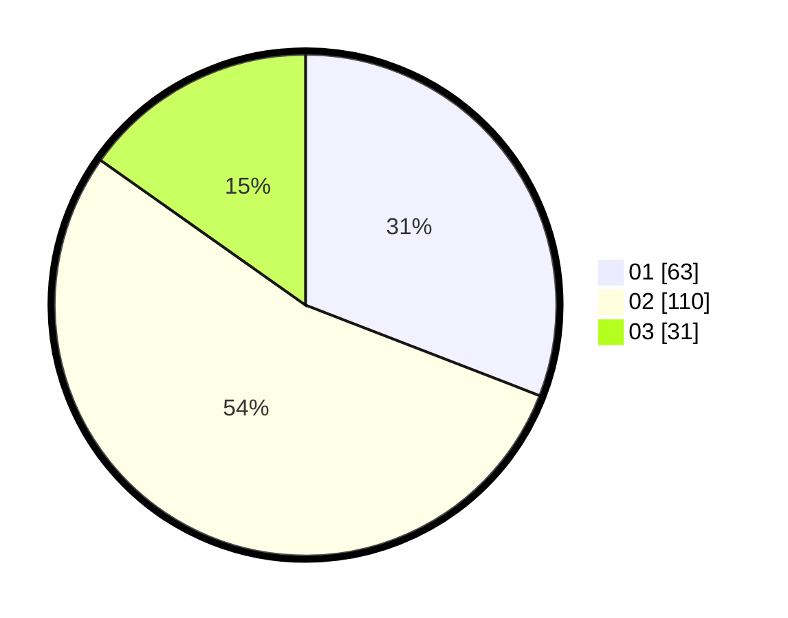

# Hasil

Hasil perolehan suara paslon dapat dilihat pada file paslon-01.txt, paslon-02.txt, dan paslon-03.txt.

Jika tidak ada, artinya data tersebut belum ada pada SIREKAP.

## Perolehan Suara

 * Paslon 01: **63**.
 * Paslon 02: **110**.
 * Paslon 03: **31**.

## Foto C Plano

https://sirekap-obj-formc.kpu.go.id/2043/pemilu/ppwp/31/73/06/10/03/3173061003155-20240216-134651--8d6cc50f-5d65-4cae-ad31-472978cc6c0d.jpg

https://sirekap-obj-formc.kpu.go.id/2043/pemilu/ppwp/31/73/06/10/03/3173061003155-20240216-134653--300fdffc-6ac7-4d2e-84a2-02716389dfed.jpg

https://sirekap-obj-formc.kpu.go.id/2043/pemilu/ppwp/31/73/06/10/03/3173061003155-20240216-134652--a429c5e9-7a84-4356-bccc-e517ccac69a7.jpg

## DATA PEMILIH TETAP

Jumlah pemilih dalam DPT: **255**.
 * L: **129**.
 * P: **126**.

## DATA PENGGUNA HAK PILIH

Jumlah pengguna hak pilih dalam DPT: **196**.
 * L: **91**.
 * P: **105**.

Jumlah pengguna hak pilih dalam DPTb: **10**.
 * L: **8**.
 * P: **2**.

Jumlah pengguna hak pilih dalam DPK: **1**.
 * L: **0**.
 * P: **1**.

Jumlah pengguna hak pilih: **207**.
 * L: **99**.
 * P: **108**.

## JUMLAH SUARA SAH DAN TIDAK SAH

JUMLAH SELURUH SUARA SAH: **204**.

JUMLAH SUARA TIDAK SAH: **3**.

JUMLAH SELURUH SUARA SAH DAN SUARA TIDAK SAH: **207**.
