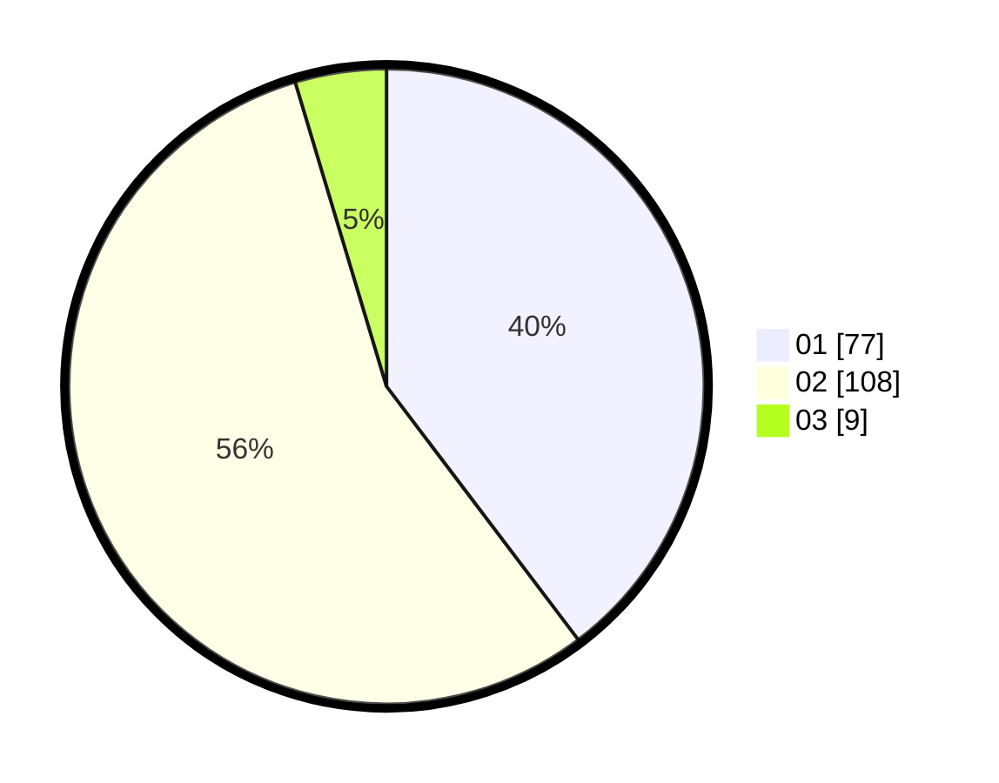

# Hasil

Hasil perolehan suara paslon dapat dilihat pada file paslon-01.txt, paslon-02.txt, dan paslon-03.txt.

Jika tidak ada, artinya data tersebut belum ada pada SIREKAP.

## Perolehan Suara

 * Paslon 01: **77**.
 * Paslon 02: **108**.
 * Paslon 03: **9**.

## Foto C Plano

https://sirekap-obj-formc.kpu.go.id/9135/pemilu/ppwp/31/73/06/10/03/3173061003156-20240214-215742--c0fdde6b-db86-4db4-9c6b-ba97578f5373.jpg

https://sirekap-obj-formc.kpu.go.id/9135/pemilu/ppwp/31/73/06/10/03/3173061003156-20240214-210842--374b1ee0-c0c4-4fda-9e39-360c09beac2e.jpg

https://sirekap-obj-formc.kpu.go.id/9135/pemilu/ppwp/31/73/06/10/03/3173061003156-20240214-210944--abac8266-7c3b-4ed7-b975-fbd782e149b5.jpg

## DATA PEMILIH TETAP

Jumlah pemilih dalam DPT: **256**.
 * L: **128**.
 * P: **128**.

## DATA PENGGUNA HAK PILIH

Jumlah pengguna hak pilih dalam DPT: **195**.
 * L: **98**.
 * P: **97**.

Jumlah pengguna hak pilih dalam DPTb: **0**.
 * L: **0**.
 * P: **0**.

Jumlah pengguna hak pilih dalam DPK: **1**.
 * L: **0**.
 * P: **1**.

Jumlah pengguna hak pilih: **196**.
 * L: **98**.
 * P: **98**.

## JUMLAH SUARA SAH DAN TIDAK SAH

JUMLAH SELURUH SUARA SAH: **194**.

JUMLAH SUARA TIDAK SAH: **3**.

JUMLAH SELURUH SUARA SAH DAN SUARA TIDAK SAH: **197**.
