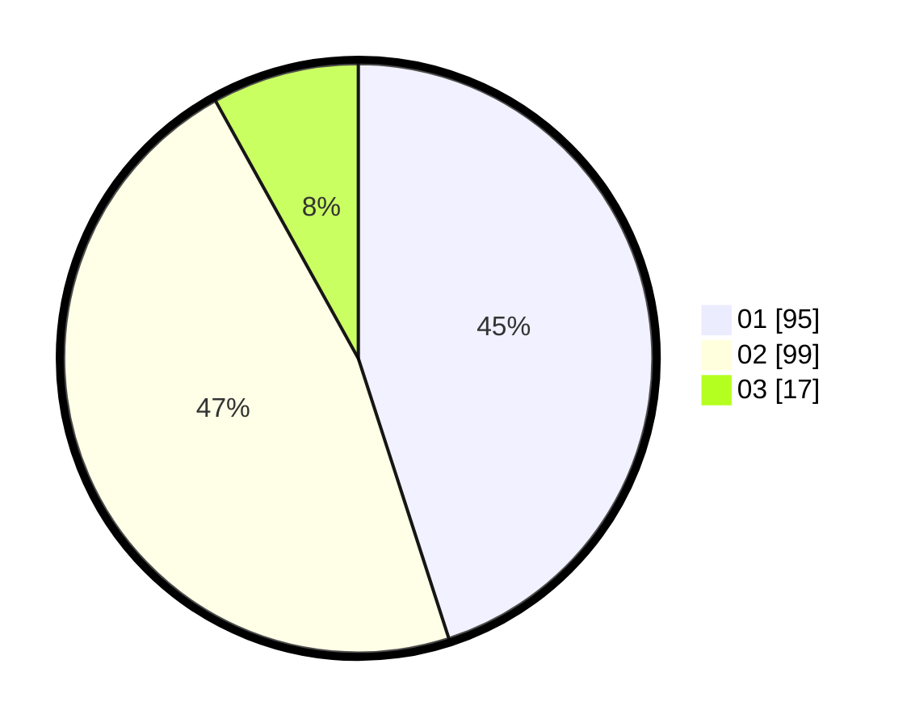

# Hasil

Hasil perolehan suara paslon dapat dilihat pada file paslon-01.txt, paslon-02.txt, dan paslon-03.txt.

Jika tidak ada, artinya data tersebut belum ada pada SIREKAP.

## Perolehan Suara

 * Paslon 01: **95**.
 * Paslon 02: **99**.
 * Paslon 03: **17**.

## Foto C Plano

https://sirekap-obj-formc.kpu.go.id/3713/pemilu/ppwp/31/73/06/10/03/3173061003157-20240214-193906--756b1e7e-c2f9-456f-a662-163656d27479.jpg

https://sirekap-obj-formc.kpu.go.id/3713/pemilu/ppwp/31/73/06/10/03/3173061003157-20240214-191803--f9065757-b8c7-4e0b-baec-9cb31d28ebbb.jpg

https://sirekap-obj-formc.kpu.go.id/3713/pemilu/ppwp/31/73/06/10/03/3173061003157-20240215-215829--64e87717-b6dd-4744-833e-37e3c59bbd40.jpg

## DATA PEMILIH TETAP

Jumlah pemilih dalam DPT: **253**.
 * L: **129**.
 * P: **124**.

## DATA PENGGUNA HAK PILIH

Jumlah pengguna hak pilih dalam DPT: **217**.
 * L: **113**.
 * P: **104**.

Jumlah pengguna hak pilih dalam DPTb: **0**.
 * L: **0**.
 * P: **0**.

Jumlah pengguna hak pilih dalam DPK: **0**.
 * L: **0**.
 * P: **0**.

Jumlah pengguna hak pilih: **217**.
 * L: **113**.
 * P: **104**.

## JUMLAH SUARA SAH DAN TIDAK SAH

JUMLAH SELURUH SUARA SAH: **211**.

JUMLAH SUARA TIDAK SAH: **6**.

JUMLAH SELURUH SUARA SAH DAN SUARA TIDAK SAH: **217**.
