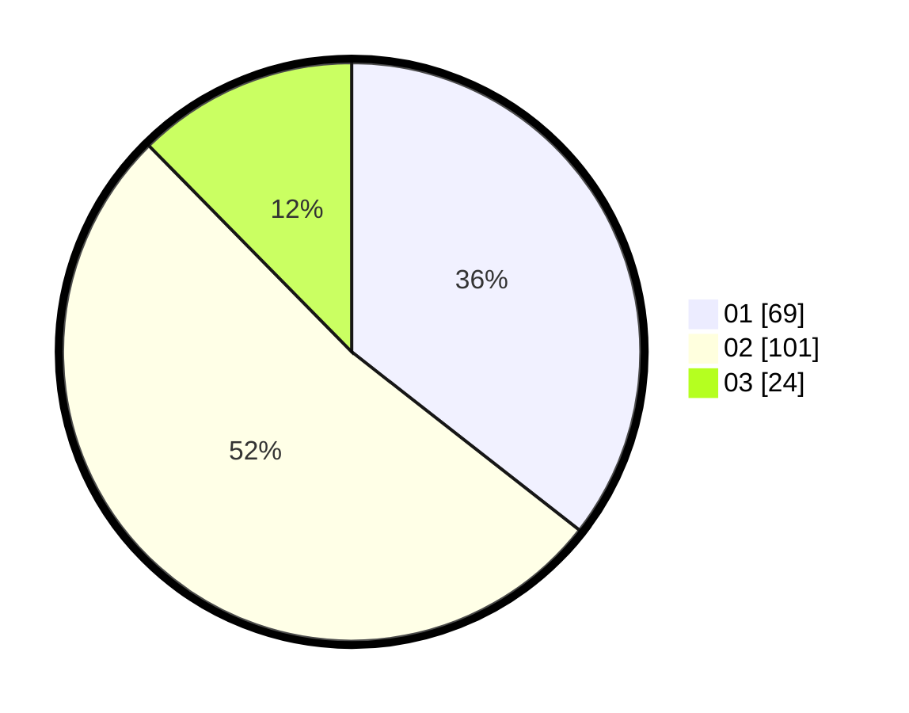

# Hasil

Hasil perolehan suara paslon dapat dilihat pada file paslon-01.txt, paslon-02.txt, dan paslon-03.txt.

Jika tidak ada, artinya data tersebut belum ada pada SIREKAP.

## Perolehan Suara

 * Paslon 01: **69**.
 * Paslon 02: **101**.
 * Paslon 03: **24**.

## Foto C Plano

https://sirekap-obj-formc.kpu.go.id/35c6/pemilu/ppwp/31/73/06/10/03/3173061003158-20240214-212415--d26cb47b-21d8-4655-a3d1-f628ad9c48fd.jpg

https://sirekap-obj-formc.kpu.go.id/35c6/pemilu/ppwp/31/73/06/10/03/3173061003158-20240214-192622--20c1012b-d193-41c0-ac06-2936bfa8fc22.jpg

https://sirekap-obj-formc.kpu.go.id/35c6/pemilu/ppwp/31/73/06/10/03/3173061003158-20240214-201825--3473d9cb-7f1d-4370-9564-e005930d1ac5.jpg
