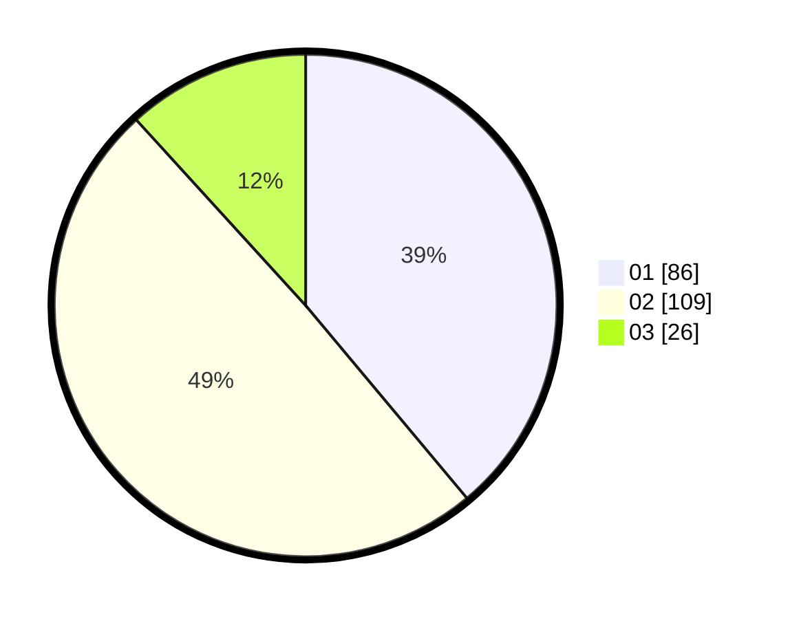

# Hasil

Hasil perolehan suara paslon dapat dilihat pada file paslon-01.txt, paslon-02.txt, dan paslon-03.txt.

Jika tidak ada, artinya data tersebut belum ada pada SIREKAP.

## Perolehan Suara

 * Paslon 01: **86**.
 * Paslon 02: **109**.
 * Paslon 03: **26**.

## Foto C Plano

https://sirekap-obj-formc.kpu.go.id/cc32/pemilu/ppwp/31/73/06/10/03/3173061003159-20240214-203838--2cf29acc-6056-4e4d-96df-0067d648c982.jpg

https://sirekap-obj-formc.kpu.go.id/cc32/pemilu/ppwp/31/73/06/10/03/3173061003159-20240214-201327--24a2a2fa-2c8f-4622-83b0-aaf75a818ce8.jpg

https://sirekap-obj-formc.kpu.go.id/cc32/pemilu/ppwp/31/73/06/10/03/3173061003159-20240214-201546--aa783581-e720-440b-921c-5003a5309ac0.jpg

## DATA PEMILIH TETAP

Jumlah pemilih dalam DPT: **268**.
 * L: **136**.
 * P: **132**.

## DATA PENGGUNA HAK PILIH

Jumlah pengguna hak pilih dalam DPT: **226**.
 * L: **110**.
 * P: **116**.

Jumlah pengguna hak pilih dalam DPTb: **0**.
 * L: **0**.
 * P: **0**.

Jumlah pengguna hak pilih dalam DPK: **2**.
 * L: **1**.
 * P: **1**.

Jumlah pengguna hak pilih: **228**.
 * L: **111**.
 * P: **117**.

## JUMLAH SUARA SAH DAN TIDAK SAH

JUMLAH SELURUH SUARA SAH: **221**.

JUMLAH SUARA TIDAK SAH: **7**.

JUMLAH SELURUH SUARA SAH DAN SUARA TIDAK SAH: **228**.
