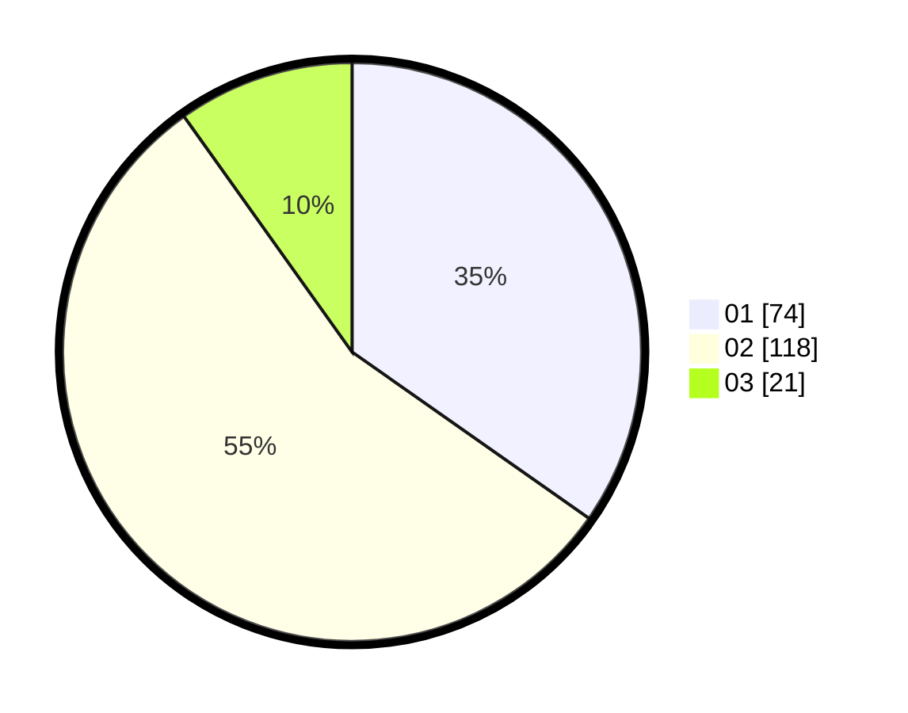

# Hasil

Hasil perolehan suara paslon dapat dilihat pada file paslon-01.txt, paslon-02.txt, dan paslon-03.txt.

Jika tidak ada, artinya data tersebut belum ada pada SIREKAP.

## Perolehan Suara

 * Paslon 01: **74**.
 * Paslon 02: **118**.
 * Paslon 03: **21**.

## Foto C Plano

https://sirekap-obj-formc.kpu.go.id/2057/pemilu/ppwp/31/73/06/10/03/3173061003161-20240216-115243--24491e73-dfe1-4845-b3d6-c52ebf910102.jpg

https://sirekap-obj-formc.kpu.go.id/2057/pemilu/ppwp/31/73/06/10/03/3173061003161-20240216-115245--d8744da8-b771-4c2a-9d8a-167ad7fda7e0.jpg

https://sirekap-obj-formc.kpu.go.id/2057/pemilu/ppwp/31/73/06/10/03/3173061003161-20240216-115244--d73b3f93-7f81-49cf-a987-3a02a9be3cab.jpg

## DATA PEMILIH TETAP

Jumlah pemilih dalam DPT: **275**.
 * L: **145**.
 * P: **130**.

## DATA PENGGUNA HAK PILIH

Jumlah pengguna hak pilih dalam DPT: **218**.
 * L: **114**.
 * P: **104**.

Jumlah pengguna hak pilih dalam DPTb: **0**.
 * L: **0**.
 * P: **0**.

Jumlah pengguna hak pilih dalam DPK: **3**.
 * L: **1**.
 * P: **2**.

Jumlah pengguna hak pilih: **221**.
 * L: **115**.
 * P: **106**.

## JUMLAH SUARA SAH DAN TIDAK SAH

JUMLAH SELURUH SUARA SAH: **213**.

JUMLAH SUARA TIDAK SAH: **8**.

JUMLAH SELURUH SUARA SAH DAN SUARA TIDAK SAH: **221**.
