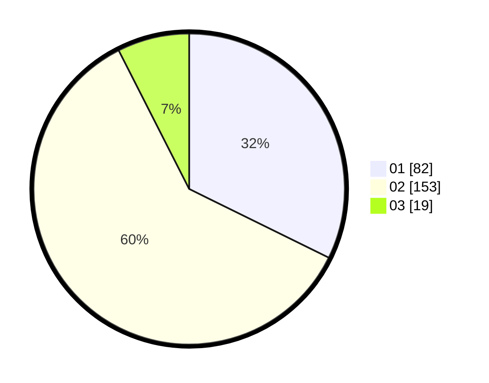

# Hasil

Hasil perolehan suara paslon dapat dilihat pada file paslon-01.txt, paslon-02.txt, dan paslon-03.txt.

Jika tidak ada, artinya data tersebut belum ada pada SIREKAP.

## Perolehan Suara

 * Paslon 01: **82**.
 * Paslon 02: **153**.
 * Paslon 03: **19**.

## Foto C Plano

https://sirekap-obj-formc.kpu.go.id/33a0/pemilu/ppwp/31/73/06/10/03/3173061003162-20240214-190735--96352ab2-092b-45ce-8cde-bfbe8b13de36.jpg

https://sirekap-obj-formc.kpu.go.id/33a0/pemilu/ppwp/31/73/06/10/03/3173061003162-20240214-191243--9c2043b9-69bf-4dd3-9c38-d9b28e712a8a.jpg

https://sirekap-obj-formc.kpu.go.id/33a0/pemilu/ppwp/31/73/06/10/03/3173061003162-20240214-192236--10ea593d-cac9-405d-a9f6-733f6e8d5e0a.jpg

## DATA PEMILIH TETAP

Jumlah pemilih dalam DPT: **279**.
 * L: **137**.
 * P: **142**.

## DATA PENGGUNA HAK PILIH

Jumlah pengguna hak pilih dalam DPT: **240**.
 * L: **119**.
 * P: **121**.

Jumlah pengguna hak pilih dalam DPTb: **0**.
 * L: **0**.
 * P: **0**.

Jumlah pengguna hak pilih dalam DPK: **21**.
 * L: **14**.
 * P: **7**.

Jumlah pengguna hak pilih: **261**.
 * L: **133**.
 * P: **128**.

## JUMLAH SUARA SAH DAN TIDAK SAH

JUMLAH SELURUH SUARA SAH: **254**.

JUMLAH SUARA TIDAK SAH: **7**.

JUMLAH SELURUH SUARA SAH DAN SUARA TIDAK SAH: **261**.
