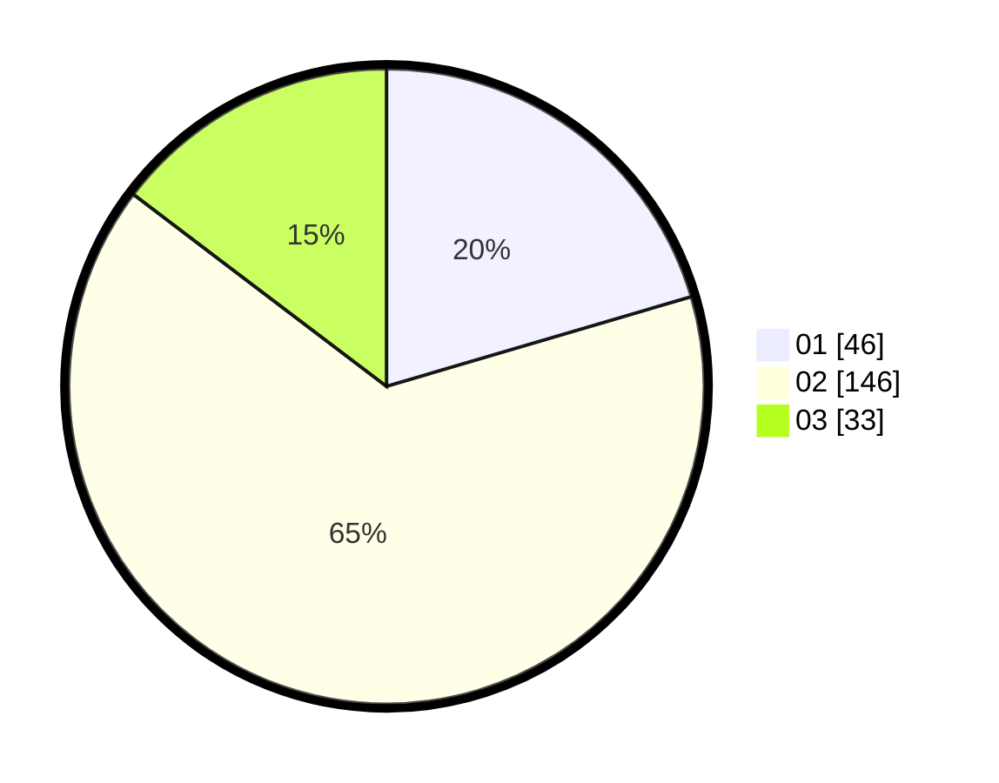

# Hasil

Hasil perolehan suara paslon dapat dilihat pada file paslon-01.txt, paslon-02.txt, dan paslon-03.txt.

Jika tidak ada, artinya data tersebut belum ada pada SIREKAP.

## Perolehan Suara

 * Paslon 01: **46**.
 * Paslon 02: **146**.
 * Paslon 03: **33**.

## Foto C Plano

https://sirekap-obj-formc.kpu.go.id/309a/pemilu/ppwp/31/73/06/10/03/3173061003164-20240214-233519--eb781dfe-52c4-4be7-a3c4-ec858f2fa16c.jpg

https://sirekap-obj-formc.kpu.go.id/309a/pemilu/ppwp/31/73/06/10/03/3173061003164-20240214-233901--bf3ccead-7290-49a5-bab9-1868d2c7b5ca.jpg

https://sirekap-obj-formc.kpu.go.id/309a/pemilu/ppwp/31/73/06/10/03/3173061003164-20240214-234035--31798dcb-7920-4f89-938e-4239f3491da0.jpg
