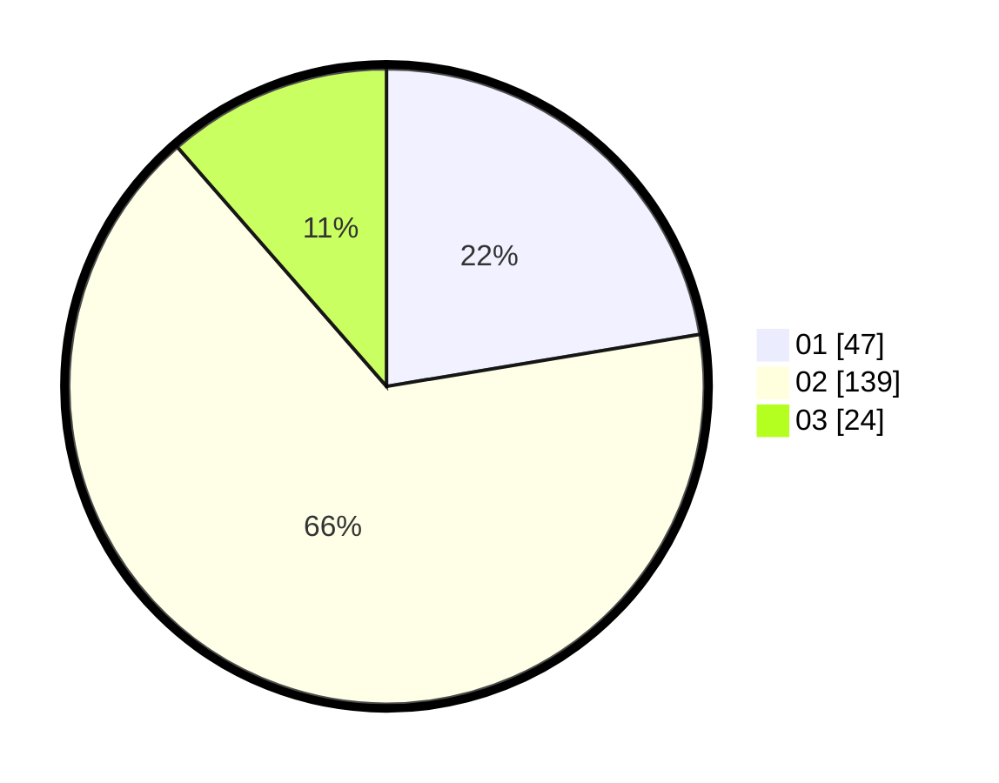

# Hasil

Hasil perolehan suara paslon dapat dilihat pada file paslon-01.txt, paslon-02.txt, dan paslon-03.txt.

Jika tidak ada, artinya data tersebut belum ada pada SIREKAP.

## Perolehan Suara

 * Paslon 01: **47**.
 * Paslon 02: **139**.
 * Paslon 03: **24**.

## Foto C Plano

https://sirekap-obj-formc.kpu.go.id/46e8/pemilu/ppwp/31/73/06/10/03/3173061003173-20240214-195857--1bbca0b2-adef-4fec-a1e9-54ead150ce3a.jpg

https://sirekap-obj-formc.kpu.go.id/46e8/pemilu/ppwp/31/73/06/10/03/3173061003173-20240214-204801--a83c2b67-8e80-4ae1-b156-ed989777e0b3.jpg

https://sirekap-obj-formc.kpu.go.id/46e8/pemilu/ppwp/31/73/06/10/03/3173061003173-20240214-200013--d9dc6193-1a8b-4ea9-a554-fd452311a377.jpg

## DATA PEMILIH TETAP

Jumlah pemilih dalam DPT: **278**.
 * L: **144**.
 * P: **134**.

## DATA PENGGUNA HAK PILIH

Jumlah pengguna hak pilih dalam DPT: **213**.
 * L: **109**.
 * P: **104**.

Jumlah pengguna hak pilih dalam DPTb: **200**.
 * L: **0**.
 * P: **0**.

Jumlah pengguna hak pilih dalam DPK: **0**.
 * L: **0**.
 * P: **0**.

Jumlah pengguna hak pilih: **213**.
 * L: **109**.
 * P: **104**.

## JUMLAH SUARA SAH DAN TIDAK SAH

JUMLAH SELURUH SUARA SAH: **217**.

JUMLAH SUARA TIDAK SAH: **7**.

JUMLAH SELURUH SUARA SAH DAN SUARA TIDAK SAH: **213**.
