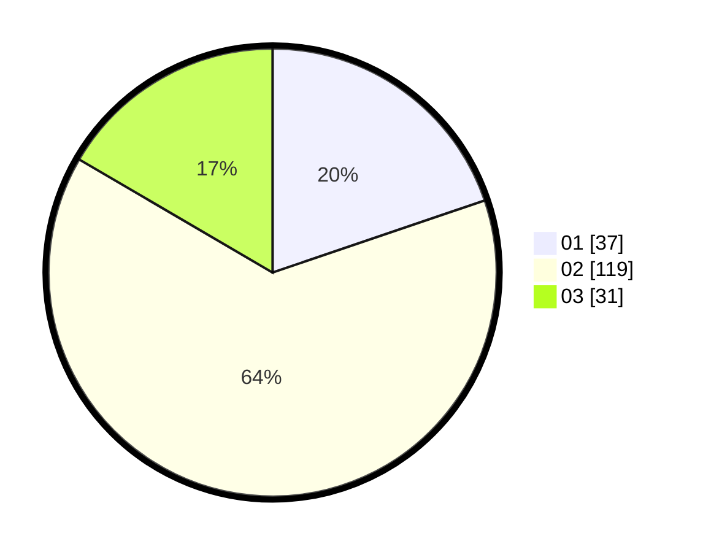

# Hasil

Hasil perolehan suara paslon dapat dilihat pada file paslon-01.txt, paslon-02.txt, dan paslon-03.txt.

Jika tidak ada, artinya data tersebut belum ada pada SIREKAP.

## Perolehan Suara

 * Paslon 01: **37**.
 * Paslon 02: **119**.
 * Paslon 03: **31**.

## Foto C Plano

https://sirekap-obj-formc.kpu.go.id/769e/pemilu/ppwp/31/73/06/10/03/3173061003180-20240214-224245--814098a5-f295-4fcc-9d79-55f8194f81ac.jpg

https://sirekap-obj-formc.kpu.go.id/769e/pemilu/ppwp/31/73/06/10/03/3173061003180-20240214-224318--da8c17c2-79ad-41ad-abf9-41065f8feb9a.jpg

https://sirekap-obj-formc.kpu.go.id/769e/pemilu/ppwp/31/73/06/10/03/3173061003180-20240214-224340--c0ff3dfd-c8cf-46f2-a04a-9154111ae7fb.jpg
