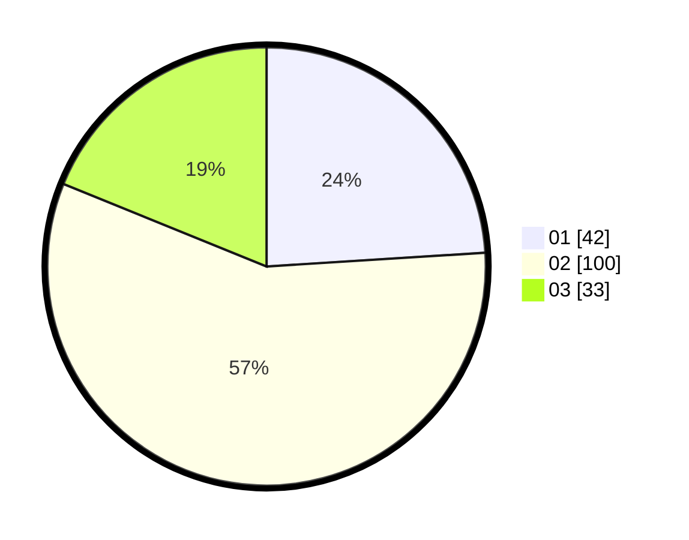

# Hasil

Hasil perolehan suara paslon dapat dilihat pada file paslon-01.txt, paslon-02.txt, dan paslon-03.txt.

Jika tidak ada, artinya data tersebut belum ada pada SIREKAP.

## Perolehan Suara

 * Paslon 01: **42**.
 * Paslon 02: **100**.
 * Paslon 03: **33**.

## Foto C Plano

https://sirekap-obj-formc.kpu.go.id/fce8/pemilu/ppwp/31/73/06/10/03/3173061003181-20240215-221425--996b7ecb-79a8-4024-bb81-38099ebacf82.jpg

https://sirekap-obj-formc.kpu.go.id/fce8/pemilu/ppwp/31/73/06/10/03/3173061003181-20240215-221427--e77af045-3841-4f60-b1b6-9d3c7fc75b4b.jpg

https://sirekap-obj-formc.kpu.go.id/fce8/pemilu/ppwp/31/73/06/10/03/3173061003181-20240215-221426--28c524dd-ca17-48c1-9362-6412e93768d9.jpg

## DATA PEMILIH TETAP

Jumlah pemilih dalam DPT: **287**.
 * L: **147**.
 * P: **140**.

## DATA PENGGUNA HAK PILIH

Jumlah pengguna hak pilih dalam DPT: **174**.
 * L: **84**.
 * P: **90**.

Jumlah pengguna hak pilih dalam DPTb: **0**.
 * L: **0**.
 * P: **0**.

Jumlah pengguna hak pilih dalam DPK: **1**.
 * L: **0**.
 * P: **1**.

Jumlah pengguna hak pilih: **175**.
 * L: **84**.
 * P: **91**.

## JUMLAH SUARA SAH DAN TIDAK SAH

JUMLAH SELURUH SUARA SAH: **175**.

JUMLAH SUARA TIDAK SAH: **0**.

JUMLAH SELURUH SUARA SAH DAN SUARA TIDAK SAH: **175**.
