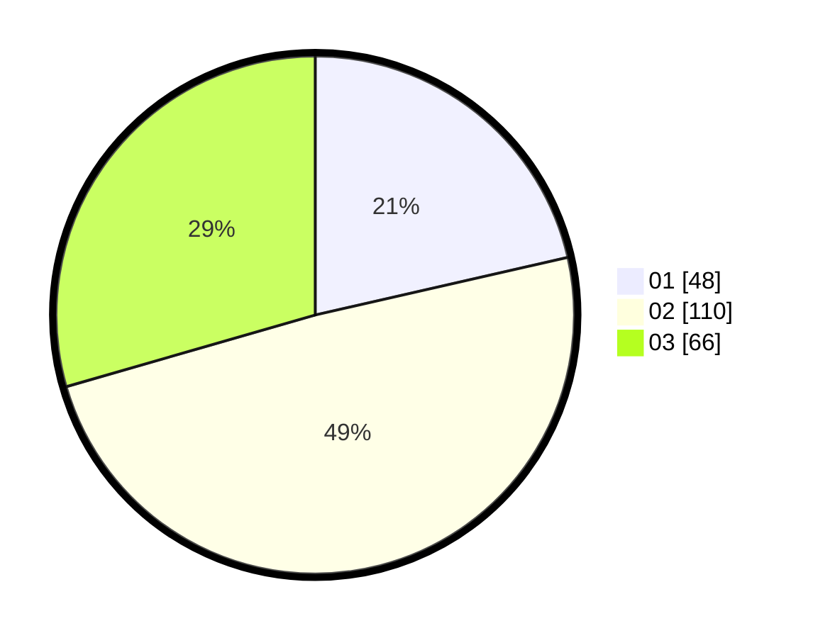

# Hasil

Hasil perolehan suara paslon dapat dilihat pada file paslon-01.txt, paslon-02.txt, dan paslon-03.txt.

Jika tidak ada, artinya data tersebut belum ada pada SIREKAP.

## Perolehan Suara

 * Paslon 01: **48**.
 * Paslon 02: **110**.
 * Paslon 03: **66**.

## Foto C Plano

https://sirekap-obj-formc.kpu.go.id/c826/pemilu/ppwp/31/73/06/10/03/3173061003187-20240214-214340--0bb45f37-c64d-4ad3-bba5-ba1d43c7ec67.jpg

https://sirekap-obj-formc.kpu.go.id/c826/pemilu/ppwp/31/73/06/10/03/3173061003187-20240214-214548--caf38dcf-d49e-4a0e-88e4-c28f6dd007ad.jpg

https://sirekap-obj-formc.kpu.go.id/c826/pemilu/ppwp/31/73/06/10/03/3173061003187-20240214-214655--06d791f9-cc6e-4ea2-ab25-b837b7cabf29.jpg
