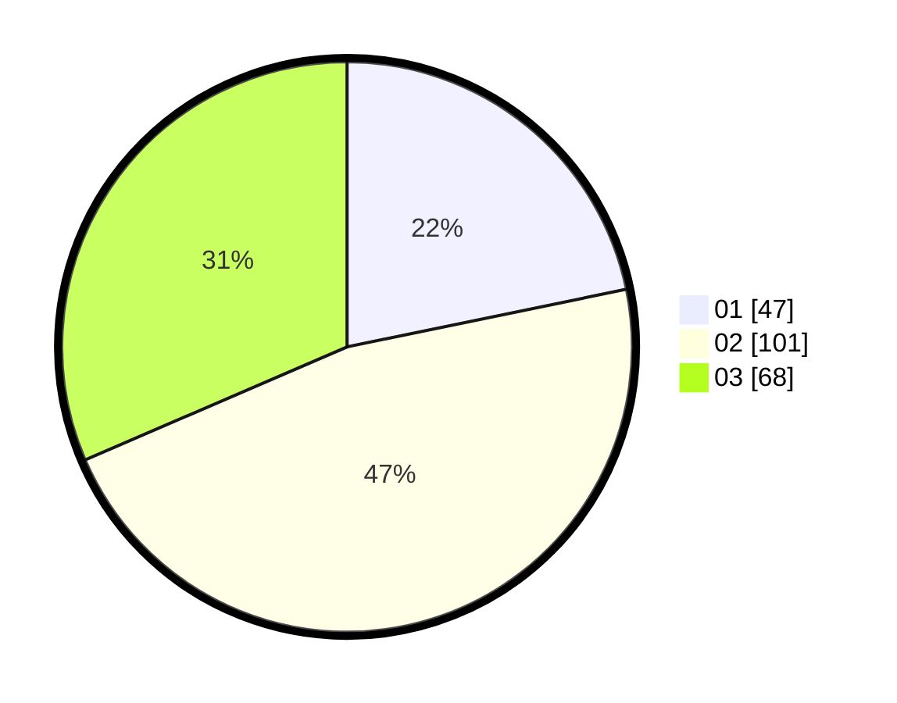

# Hasil

Hasil perolehan suara paslon dapat dilihat pada file paslon-01.txt, paslon-02.txt, dan paslon-03.txt.

Jika tidak ada, artinya data tersebut belum ada pada SIREKAP.

## Perolehan Suara

 * Paslon 01: **47**.
 * Paslon 02: **101**.
 * Paslon 03: **68**.

## Foto C Plano

https://sirekap-obj-formc.kpu.go.id/8a7f/pemilu/ppwp/31/73/06/10/03/3173061003188-20240214-221500--ad4680fe-c40f-48c6-8999-bc86040fa04b.jpg

https://sirekap-obj-formc.kpu.go.id/8a7f/pemilu/ppwp/31/73/06/10/03/3173061003188-20240214-221616--abadaf0a-b55a-49f2-ac70-b87273abc0ad.jpg

https://sirekap-obj-formc.kpu.go.id/8a7f/pemilu/ppwp/31/73/06/10/03/3173061003188-20240214-221747--c18cef75-641c-4379-a2e9-1387070c57c6.jpg
