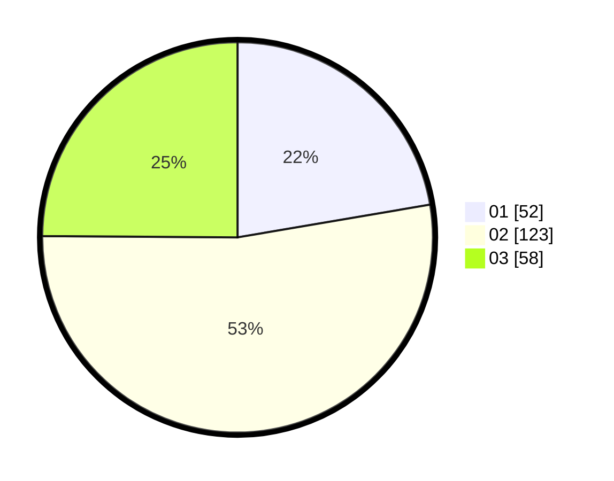

# Hasil

Hasil perolehan suara paslon dapat dilihat pada file paslon-01.txt, paslon-02.txt, dan paslon-03.txt.

Jika tidak ada, artinya data tersebut belum ada pada SIREKAP.

## Perolehan Suara

 * Paslon 01: **52**.
 * Paslon 02: **123**.
 * Paslon 03: **58**.

## Foto C Plano

https://sirekap-obj-formc.kpu.go.id/91d9/pemilu/ppwp/31/73/06/10/03/3173061003189-20240216-141202--11d1b362-a43a-49d6-b542-5a9ad418d0cb.jpg

https://sirekap-obj-formc.kpu.go.id/91d9/pemilu/ppwp/31/73/06/10/03/3173061003189-20240216-141204--5757a363-744f-4459-916f-27b49a56be27.jpg

https://sirekap-obj-formc.kpu.go.id/91d9/pemilu/ppwp/31/73/06/10/03/3173061003189-20240216-141203--39ce2aa4-96e0-4d02-b477-458abd17a230.jpg

## DATA PEMILIH TETAP

Jumlah pemilih dalam DPT: **297**.
 * L: **144**.
 * P: **153**.

## DATA PENGGUNA HAK PILIH

Jumlah pengguna hak pilih dalam DPT: **234**.
 * L: **110**.
 * P: **124**.

Jumlah pengguna hak pilih dalam DPTb: **3**.
 * L: **1**.
 * P: **2**.

Jumlah pengguna hak pilih dalam DPK: **0**.
 * L: **0**.
 * P: **0**.

Jumlah pengguna hak pilih: **237**.
 * L: **111**.
 * P: **126**.

## JUMLAH SUARA SAH DAN TIDAK SAH

JUMLAH SELURUH SUARA SAH: **233**.

JUMLAH SUARA TIDAK SAH: **4**.

JUMLAH SELURUH SUARA SAH DAN SUARA TIDAK SAH: **237**.
