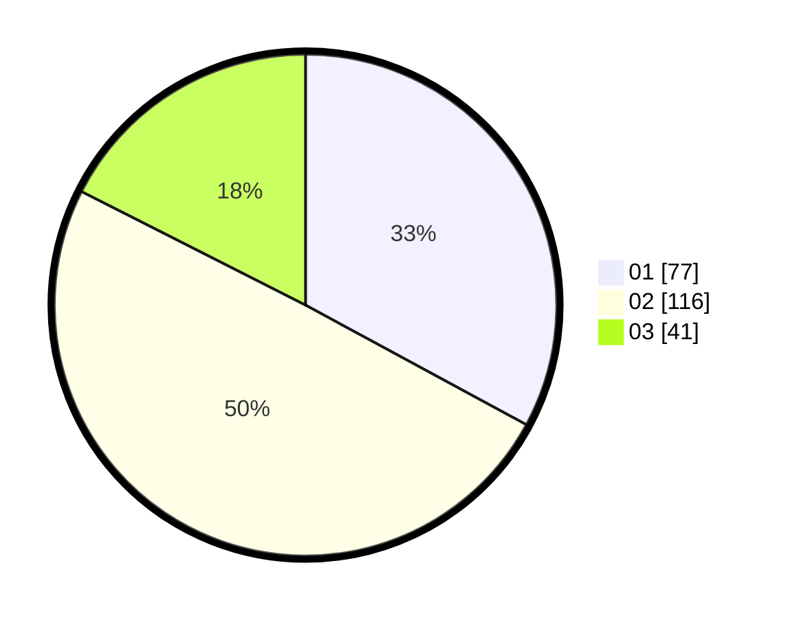

# Hasil

Hasil perolehan suara paslon dapat dilihat pada file paslon-01.txt, paslon-02.txt, dan paslon-03.txt.

Jika tidak ada, artinya data tersebut belum ada pada SIREKAP.

## Perolehan Suara

 * Paslon 01: **77**.
 * Paslon 02: **116**.
 * Paslon 03: **41**.

## Foto C Plano

https://sirekap-obj-formc.kpu.go.id/3159/pemilu/ppwp/31/73/06/10/03/3173061003195-20240215-225635--f8956536-3471-4e9a-9e5f-e96702b185ab.jpg

https://sirekap-obj-formc.kpu.go.id/3159/pemilu/ppwp/31/73/06/10/03/3173061003195-20240215-225637--d080e83e-05fc-4777-9e42-63b0c0ca5887.jpg

https://sirekap-obj-formc.kpu.go.id/3159/pemilu/ppwp/31/73/06/10/03/3173061003195-20240215-225636--a863d0fb-7d6f-4222-ba37-635ea3acaf0a.jpg

## DATA PEMILIH TETAP

Jumlah pemilih dalam DPT: **292**.
 * L: **133**.
 * P: **159**.

## DATA PENGGUNA HAK PILIH

Jumlah pengguna hak pilih dalam DPT: **235**.
 * L: **100**.
 * P: **135**.

Jumlah pengguna hak pilih dalam DPTb: **0**.
 * L: **0**.
 * P: **0**.

Jumlah pengguna hak pilih dalam DPK: **5**.
 * L: **2**.
 * P: **3**.

Jumlah pengguna hak pilih: **240**.
 * L: **102**.
 * P: **138**.

## JUMLAH SUARA SAH DAN TIDAK SAH

JUMLAH SELURUH SUARA SAH: **234**.

JUMLAH SUARA TIDAK SAH: **6**.

JUMLAH SELURUH SUARA SAH DAN SUARA TIDAK SAH: **240**.
