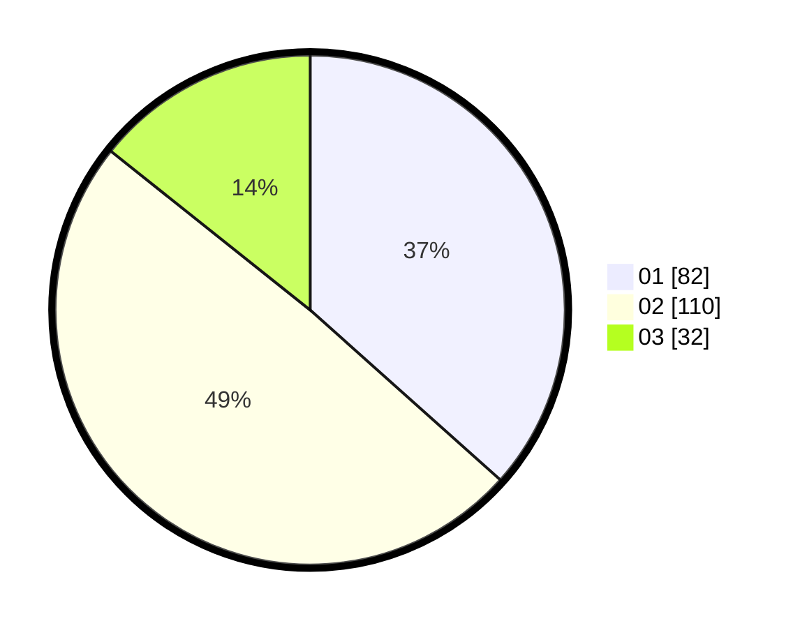

# Hasil

Hasil perolehan suara paslon dapat dilihat pada file paslon-01.txt, paslon-02.txt, dan paslon-03.txt.

Jika tidak ada, artinya data tersebut belum ada pada SIREKAP.

## Perolehan Suara

 * Paslon 01: **82**.
 * Paslon 02: **110**.
 * Paslon 03: **32**.

## Foto C Plano

https://sirekap-obj-formc.kpu.go.id/6ffb/pemilu/ppwp/31/73/06/10/03/3173061003196-20240214-190154--ddbb5734-ce5f-4550-a1c6-805e5c0c6ba9.jpg

https://sirekap-obj-formc.kpu.go.id/6ffb/pemilu/ppwp/31/73/06/10/03/3173061003196-20240214-190613--a1922ad5-366f-43ae-a932-a1dbf0e40611.jpg

https://sirekap-obj-formc.kpu.go.id/6ffb/pemilu/ppwp/31/73/06/10/03/3173061003196-20240214-190327--1fe36256-1493-4418-b768-ad8cd213e7a4.jpg

## DATA PEMILIH TETAP

Jumlah pemilih dalam DPT: **298**.
 * L: **159**.
 * P: **139**.

## DATA PENGGUNA HAK PILIH

Jumlah pengguna hak pilih dalam DPT: **219**.
 * L: **111**.
 * P: **108**.

Jumlah pengguna hak pilih dalam DPTb: **8**.
 * L: **5**.
 * P: **3**.

Jumlah pengguna hak pilih dalam DPK: **1**.
 * L: **0**.
 * P: **1**.

Jumlah pengguna hak pilih: **228**.
 * L: **116**.
 * P: **112**.

## JUMLAH SUARA SAH DAN TIDAK SAH

JUMLAH SELURUH SUARA SAH: **224**.

JUMLAH SUARA TIDAK SAH: **4**.

JUMLAH SELURUH SUARA SAH DAN SUARA TIDAK SAH: **228**.
