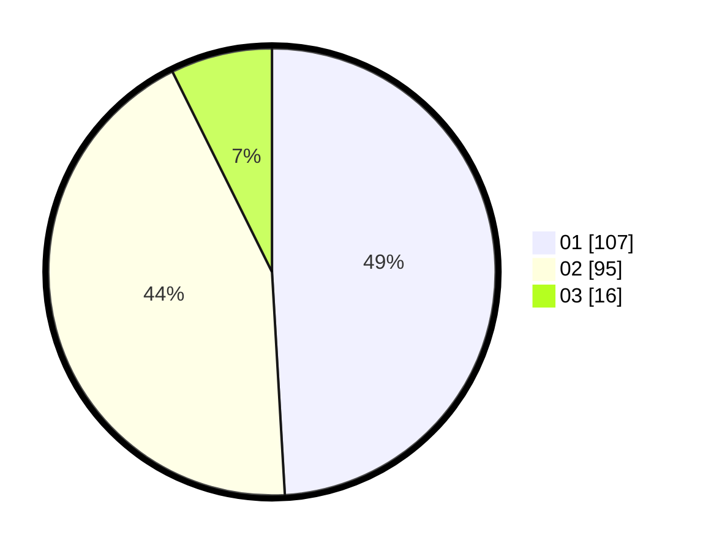

# Hasil

Hasil perolehan suara paslon dapat dilihat pada file paslon-01.txt, paslon-02.txt, dan paslon-03.txt.

Jika tidak ada, artinya data tersebut belum ada pada SIREKAP.

## Perolehan Suara

 * Paslon 01: **107**.
 * Paslon 02: **95**.
 * Paslon 03: **16**.

## Foto C Plano

https://sirekap-obj-formc.kpu.go.id/2f8a/pemilu/ppwp/31/73/06/10/03/3173061003198-20240214-223829--9b155a17-9a27-4d0e-a0ae-64372a545ae7.jpg

https://sirekap-obj-formc.kpu.go.id/2f8a/pemilu/ppwp/31/73/06/10/03/3173061003198-20240214-223913--6b4f94f7-012b-4542-bf1e-4d30637a3802.jpg

https://sirekap-obj-formc.kpu.go.id/2f8a/pemilu/ppwp/31/73/06/10/03/3173061003198-20240214-221734--a3a0514b-592d-446d-93de-0f3092ee9562.jpg
