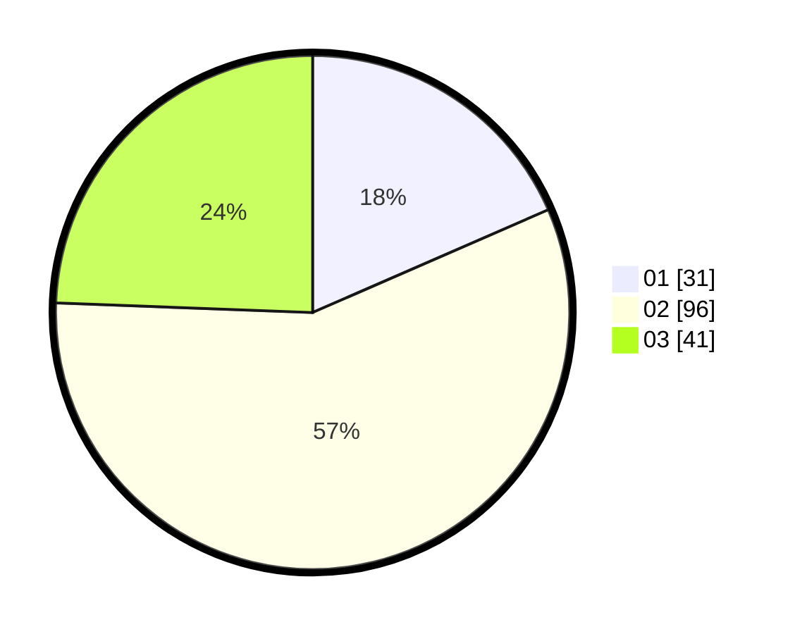

# Hasil

Hasil perolehan suara paslon dapat dilihat pada file paslon-01.txt, paslon-02.txt, dan paslon-03.txt.

Jika tidak ada, artinya data tersebut belum ada pada SIREKAP.

## Perolehan Suara

 * Paslon 01: **31**.
 * Paslon 02: **96**.
 * Paslon 03: **41**.

## Foto C Plano

https://sirekap-obj-formc.kpu.go.id/a722/pemilu/ppwp/31/73/06/10/03/3173061003200-20240214-213258--0f51d76a-bd15-491c-b443-fb2da2c29b77.jpg

https://sirekap-obj-formc.kpu.go.id/a722/pemilu/ppwp/31/73/06/10/03/3173061003200-20240214-213353--706bff5e-78c9-4ba3-82ed-44a1070ff499.jpg

https://sirekap-obj-formc.kpu.go.id/a722/pemilu/ppwp/31/73/06/10/03/3173061003200-20240214-213442--67886958-924a-41c9-b0ca-c4b1f85941e9.jpg

## DATA PEMILIH TETAP

Jumlah pemilih dalam DPT: **225**.
 * L: **107**.
 * P: **118**.

## DATA PENGGUNA HAK PILIH

Jumlah pengguna hak pilih dalam DPT: **170**.
 * L: **77**.
 * P: **93**.

Jumlah pengguna hak pilih dalam DPTb: **0**.
 * L: **0**.
 * P: **0**.

Jumlah pengguna hak pilih dalam DPK: **0**.
 * L: **0**.
 * P: **0**.

Jumlah pengguna hak pilih: **170**.
 * L: **77**.
 * P: **93**.

## JUMLAH SUARA SAH DAN TIDAK SAH

JUMLAH SELURUH SUARA SAH: **168**.

JUMLAH SUARA TIDAK SAH: **2**.

JUMLAH SELURUH SUARA SAH DAN SUARA TIDAK SAH: **170**.
