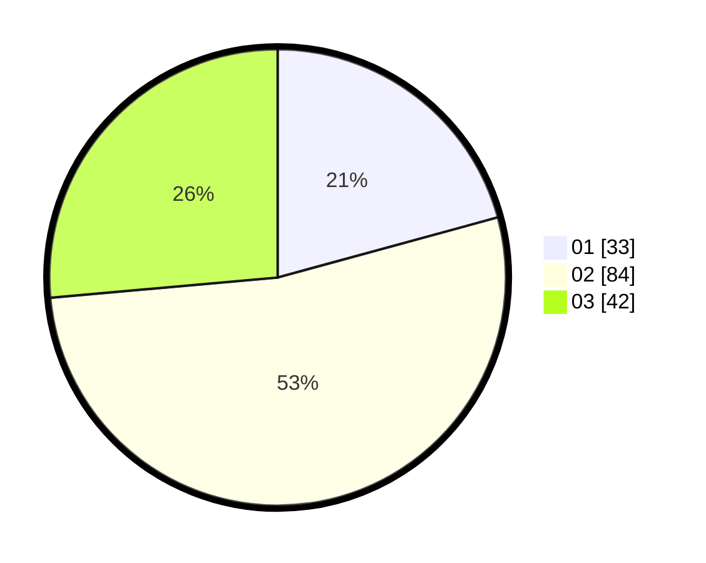

# Hasil

Hasil perolehan suara paslon dapat dilihat pada file paslon-01.txt, paslon-02.txt, dan paslon-03.txt.

Jika tidak ada, artinya data tersebut belum ada pada SIREKAP.

## Perolehan Suara

 * Paslon 01: **33**.
 * Paslon 02: **84**.
 * Paslon 03: **42**.

## Foto C Plano

https://sirekap-obj-formc.kpu.go.id/c50d/pemilu/ppwp/31/73/06/10/03/3173061003206-20240215-001917--ab80d1f3-c991-446a-89d8-7469c799a377.jpg

https://sirekap-obj-formc.kpu.go.id/c50d/pemilu/ppwp/31/73/06/10/03/3173061003206-20240215-002057--76b0c548-6a32-4247-881b-902daacff929.jpg

https://sirekap-obj-formc.kpu.go.id/c50d/pemilu/ppwp/31/73/06/10/03/3173061003206-20240215-002202--101e87ab-48ff-4d65-b2cb-09388d5e3ce7.jpg

## DATA PEMILIH TETAP

Jumlah pemilih dalam DPT: **159**.
 * L: **76**.
 * P: **83**.

## DATA PENGGUNA HAK PILIH

Jumlah pengguna hak pilih dalam DPT: **157**.
 * L: **75**.
 * P: **82**.

Jumlah pengguna hak pilih dalam DPTb: **2**.
 * L: **1**.
 * P: **1**.

Jumlah pengguna hak pilih dalam DPK: **0**.
 * L: **0**.
 * P: **0**.

Jumlah pengguna hak pilih: **159**.
 * L: **76**.
 * P: **83**.

## JUMLAH SUARA SAH DAN TIDAK SAH

JUMLAH SELURUH SUARA SAH: **159**.

JUMLAH SUARA TIDAK SAH: **0**.

JUMLAH SELURUH SUARA SAH DAN SUARA TIDAK SAH: **159**.
