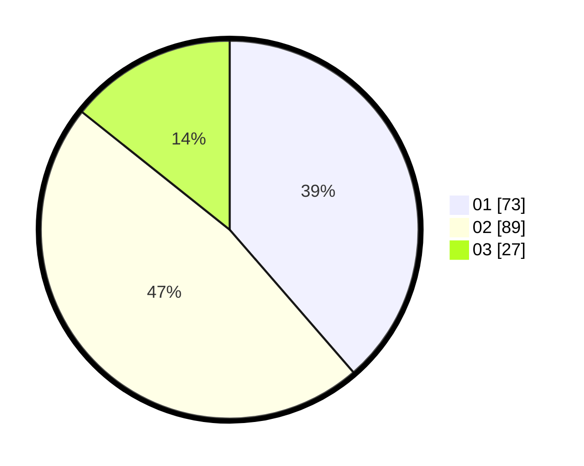

# Hasil

Hasil perolehan suara paslon dapat dilihat pada file paslon-01.txt, paslon-02.txt, dan paslon-03.txt.

Jika tidak ada, artinya data tersebut belum ada pada SIREKAP.

## Perolehan Suara

 * Paslon 01: **73**.
 * Paslon 02: **89**.
 * Paslon 03: **27**.

## Foto C Plano

https://sirekap-obj-formc.kpu.go.id/e0c6/pemilu/ppwp/31/73/06/10/03/3173061003223-20240216-012633--289a4971-499a-4ce8-b0ec-9402166cfef4.jpg

https://sirekap-obj-formc.kpu.go.id/e0c6/pemilu/ppwp/31/73/06/10/03/3173061003223-20240216-012634--c424ad1c-4dc9-40dc-9ff0-67ae1d26a62c.jpg

https://sirekap-obj-formc.kpu.go.id/e0c6/pemilu/ppwp/31/73/06/10/03/3173061003223-20240216-012634--25513287-e208-46a8-b56d-b337419aca57.jpg

## DATA PEMILIH TETAP

Jumlah pemilih dalam DPT: **254**.
 * L: **131**.
 * P: **123**.

## DATA PENGGUNA HAK PILIH

Jumlah pengguna hak pilih dalam DPT: **190**.
 * L: **94**.
 * P: **96**.

Jumlah pengguna hak pilih dalam DPTb: **0**.
 * L: **0**.
 * P: **0**.

Jumlah pengguna hak pilih dalam DPK: **0**.
 * L: **0**.
 * P: **0**.

Jumlah pengguna hak pilih: **190**.
 * L: **94**.
 * P: **96**.

## JUMLAH SUARA SAH DAN TIDAK SAH

JUMLAH SELURUH SUARA SAH: **189**.

JUMLAH SUARA TIDAK SAH: **1**.

JUMLAH SELURUH SUARA SAH DAN SUARA TIDAK SAH: **190**.
