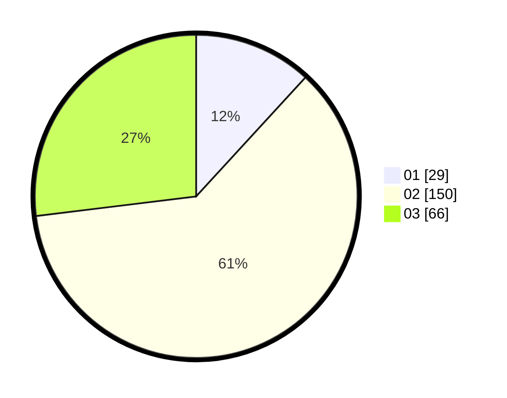

# Hasil

Hasil perolehan suara paslon dapat dilihat pada file paslon-01.txt, paslon-02.txt, dan paslon-03.txt.

Jika tidak ada, artinya data tersebut belum ada pada SIREKAP.

## Perolehan Suara

 * Paslon 01: **29**.
 * Paslon 02: **150**.
 * Paslon 03: **66**.

## Foto C Plano

https://sirekap-obj-formc.kpu.go.id/c0d3/pemilu/ppwp/31/73/06/10/03/3173061003224-20240214-201407--d5da674e-fbaf-4eba-8d67-55319b4798d0.jpg

https://sirekap-obj-formc.kpu.go.id/c0d3/pemilu/ppwp/31/73/06/10/03/3173061003224-20240214-160122--d34fec8b-4679-4581-a9cb-e33584f92539.jpg
