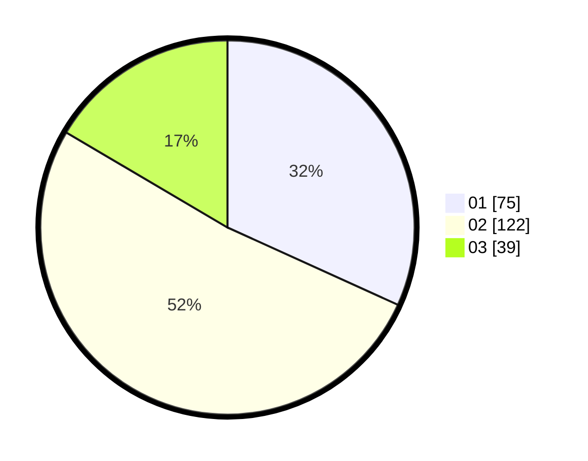

# Hasil

Hasil perolehan suara paslon dapat dilihat pada file paslon-01.txt, paslon-02.txt, dan paslon-03.txt.

Jika tidak ada, artinya data tersebut belum ada pada SIREKAP.

## Perolehan Suara

 * Paslon 01: **75**.
 * Paslon 02: **122**.
 * Paslon 03: **39**.

## Foto C Plano

https://sirekap-obj-formc.kpu.go.id/b958/pemilu/ppwp/31/73/06/10/03/3173061003228-20240214-204854--ef7d92de-a108-442a-8e47-1bced5a5b426.jpg

https://sirekap-obj-formc.kpu.go.id/b958/pemilu/ppwp/31/73/06/10/03/3173061003228-20240214-155230--bfb972e3-4f71-4f0e-a651-4b674b7e036f.jpg

https://sirekap-obj-formc.kpu.go.id/b958/pemilu/ppwp/31/73/06/10/03/3173061003228-20240214-220530--6dc0e6d4-5de5-4956-9cd5-690a429f4fa7.jpg

## DATA PEMILIH TETAP

Jumlah pemilih dalam DPT: **294**.
 * L: **142**.
 * P: **152**.

## DATA PENGGUNA HAK PILIH

Jumlah pengguna hak pilih dalam DPT: **234**.
 * L: **109**.
 * P: **125**.

Jumlah pengguna hak pilih dalam DPTb: **0**.
 * L: **0**.
 * P: **0**.

Jumlah pengguna hak pilih dalam DPK: **7**.
 * L: **4**.
 * P: **3**.

Jumlah pengguna hak pilih: **241**.
 * L: **113**.
 * P: **128**.

## JUMLAH SUARA SAH DAN TIDAK SAH

JUMLAH SELURUH SUARA SAH: **236**.

JUMLAH SUARA TIDAK SAH: **5**.

JUMLAH SELURUH SUARA SAH DAN SUARA TIDAK SAH: **241**.
