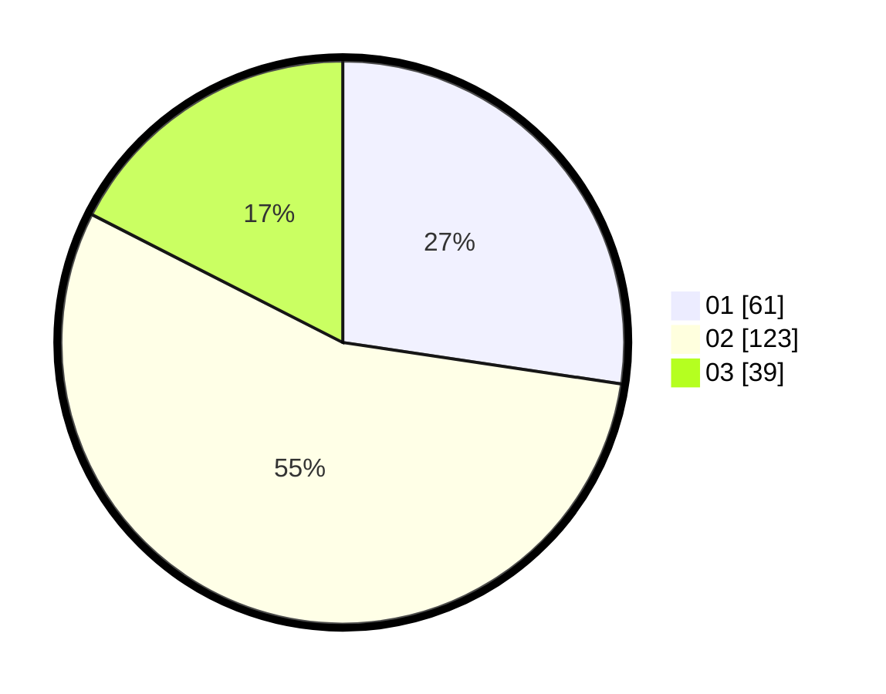

# Hasil

Hasil perolehan suara paslon dapat dilihat pada file paslon-01.txt, paslon-02.txt, dan paslon-03.txt.

Jika tidak ada, artinya data tersebut belum ada pada SIREKAP.

## Perolehan Suara

 * Paslon 01: **61**.
 * Paslon 02: **123**.
 * Paslon 03: **39**.

## Foto C Plano

https://sirekap-obj-formc.kpu.go.id/65bc/pemilu/ppwp/31/73/06/10/03/3173061003229-20240214-192032--9868454b-c937-4148-a136-11e105fb615b.jpg

https://sirekap-obj-formc.kpu.go.id/65bc/pemilu/ppwp/31/73/06/10/03/3173061003229-20240214-214709--dd9699ff-c0a8-418a-9948-2a439e5c3fbe.jpg

https://sirekap-obj-formc.kpu.go.id/65bc/pemilu/ppwp/31/73/06/10/03/3173061003229-20240214-214834--18152d9b-e46f-474e-816a-4213f6500fb9.jpg
