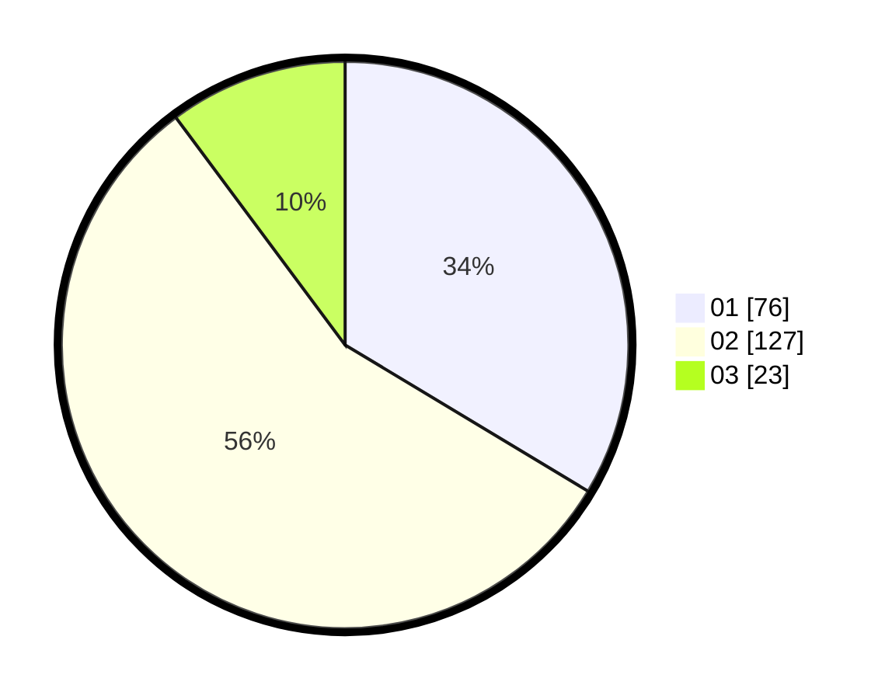

# Hasil

Hasil perolehan suara paslon dapat dilihat pada file paslon-01.txt, paslon-02.txt, dan paslon-03.txt.

Jika tidak ada, artinya data tersebut belum ada pada SIREKAP.

## Perolehan Suara

 * Paslon 01: **76**.
 * Paslon 02: **127**.
 * Paslon 03: **23**.

## Foto C Plano

https://sirekap-obj-formc.kpu.go.id/00cb/pemilu/ppwp/31/73/06/10/03/3173061003231-20240214-230433--8adc8cd9-d02a-4082-bd11-a27e7a519ef9.jpg

https://sirekap-obj-formc.kpu.go.id/00cb/pemilu/ppwp/31/73/06/10/03/3173061003231-20240214-230536--c3d77143-3d47-4f63-a229-91d414a83c85.jpg

https://sirekap-obj-formc.kpu.go.id/00cb/pemilu/ppwp/31/73/06/10/03/3173061003231-20240214-230623--ff166a19-4b9c-4212-b7a6-9acb97b02adf.jpg

## DATA PEMILIH TETAP

Jumlah pemilih dalam DPT: **291**.
 * L: **155**.
 * P: **136**.

## DATA PENGGUNA HAK PILIH

Jumlah pengguna hak pilih dalam DPT: **226**.
 * L: **123**.
 * P: **103**.

Jumlah pengguna hak pilih dalam DPTb: **0**.
 * L: **0**.
 * P: **0**.

Jumlah pengguna hak pilih dalam DPK: **3**.
 * L: **0**.
 * P: **3**.

Jumlah pengguna hak pilih: **229**.
 * L: **123**.
 * P: **106**.

## JUMLAH SUARA SAH DAN TIDAK SAH

JUMLAH SELURUH SUARA SAH: **226**.

JUMLAH SUARA TIDAK SAH: **3**.

JUMLAH SELURUH SUARA SAH DAN SUARA TIDAK SAH: **229**.
