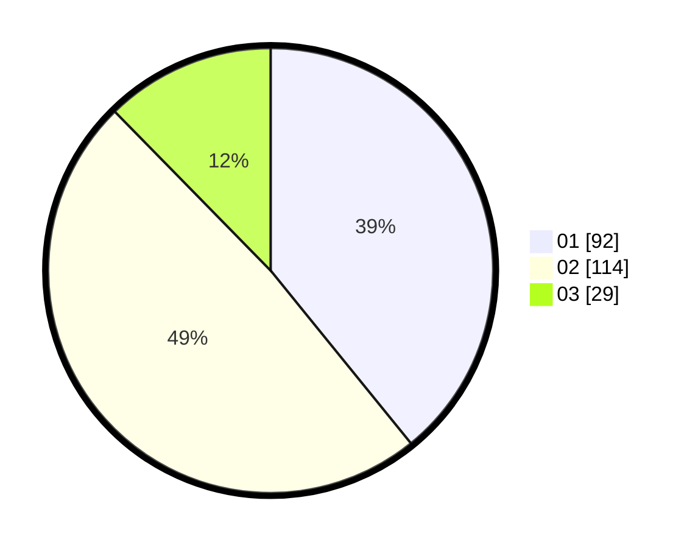

# Hasil

Hasil perolehan suara paslon dapat dilihat pada file paslon-01.txt, paslon-02.txt, dan paslon-03.txt.

Jika tidak ada, artinya data tersebut belum ada pada SIREKAP.

## Perolehan Suara

 * Paslon 01: **92**.
 * Paslon 02: **114**.
 * Paslon 03: **29**.

## Foto C Plano

https://sirekap-obj-formc.kpu.go.id/b020/pemilu/ppwp/31/73/06/10/03/3173061003237-20240214-200558--c6e1c254-9257-4b76-b1df-a17a1213fc26.jpg

https://sirekap-obj-formc.kpu.go.id/b020/pemilu/ppwp/31/73/06/10/03/3173061003237-20240214-200635--4875463f-3cf5-498a-8618-f5b5b84240d6.jpg

https://sirekap-obj-formc.kpu.go.id/b020/pemilu/ppwp/31/73/06/10/03/3173061003237-20240214-222757--1fd6ca0b-7261-4a57-be09-837be9a23730.jpg

## DATA PEMILIH TETAP

Jumlah pemilih dalam DPT: **292**.
 * L: **147**.
 * P: **145**.

## DATA PENGGUNA HAK PILIH

Jumlah pengguna hak pilih dalam DPT: **235**.
 * L: **112**.
 * P: **123**.

Jumlah pengguna hak pilih dalam DPTb: **0**.
 * L: **0**.
 * P: **0**.

Jumlah pengguna hak pilih dalam DPK: **0**.
 * L: **0**.
 * P: **0**.

Jumlah pengguna hak pilih: **235**.
 * L: **112**.
 * P: **123**.

## JUMLAH SUARA SAH DAN TIDAK SAH

JUMLAH SELURUH SUARA SAH: **234**.

JUMLAH SUARA TIDAK SAH: **1**.

JUMLAH SELURUH SUARA SAH DAN SUARA TIDAK SAH: **235**.
