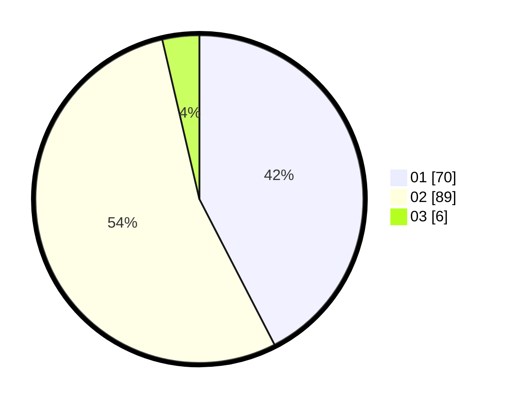

# Hasil

Hasil perolehan suara paslon dapat dilihat pada file paslon-01.txt, paslon-02.txt, dan paslon-03.txt.

Jika tidak ada, artinya data tersebut belum ada pada SIREKAP.

## Perolehan Suara

 * Paslon 01: **70**.
 * Paslon 02: **89**.
 * Paslon 03: **6**.

## Foto C Plano

https://sirekap-obj-formc.kpu.go.id/f6a3/pemilu/ppwp/31/73/06/10/03/3173061003246-20240216-093022--9d2092b3-8220-4172-955d-f44ec6c6c66a.jpg

https://sirekap-obj-formc.kpu.go.id/f6a3/pemilu/ppwp/31/73/06/10/03/3173061003246-20240214-192945--c605c72e-acd2-4e1e-ac4e-4295821c6cfe.jpg

https://sirekap-obj-formc.kpu.go.id/f6a3/pemilu/ppwp/31/73/06/10/03/3173061003246-20240214-193133--11c62eca-9086-4277-99c7-dae605d719b8.jpg

## DATA PEMILIH TETAP

Jumlah pemilih dalam DPT: **234**.
 * L: **125**.
 * P: **109**.

## DATA PENGGUNA HAK PILIH

Jumlah pengguna hak pilih dalam DPT: **168**.
 * L: **83**.
 * P: **85**.

Jumlah pengguna hak pilih dalam DPTb: **0**.
 * L: **0**.
 * P: **0**.

Jumlah pengguna hak pilih dalam DPK: **0**.
 * L: **0**.
 * P: **0**.

Jumlah pengguna hak pilih: **168**.
 * L: **83**.
 * P: **85**.

## JUMLAH SUARA SAH DAN TIDAK SAH

JUMLAH SELURUH SUARA SAH: **165**.

JUMLAH SUARA TIDAK SAH: **3**.

JUMLAH SELURUH SUARA SAH DAN SUARA TIDAK SAH: **168**.
