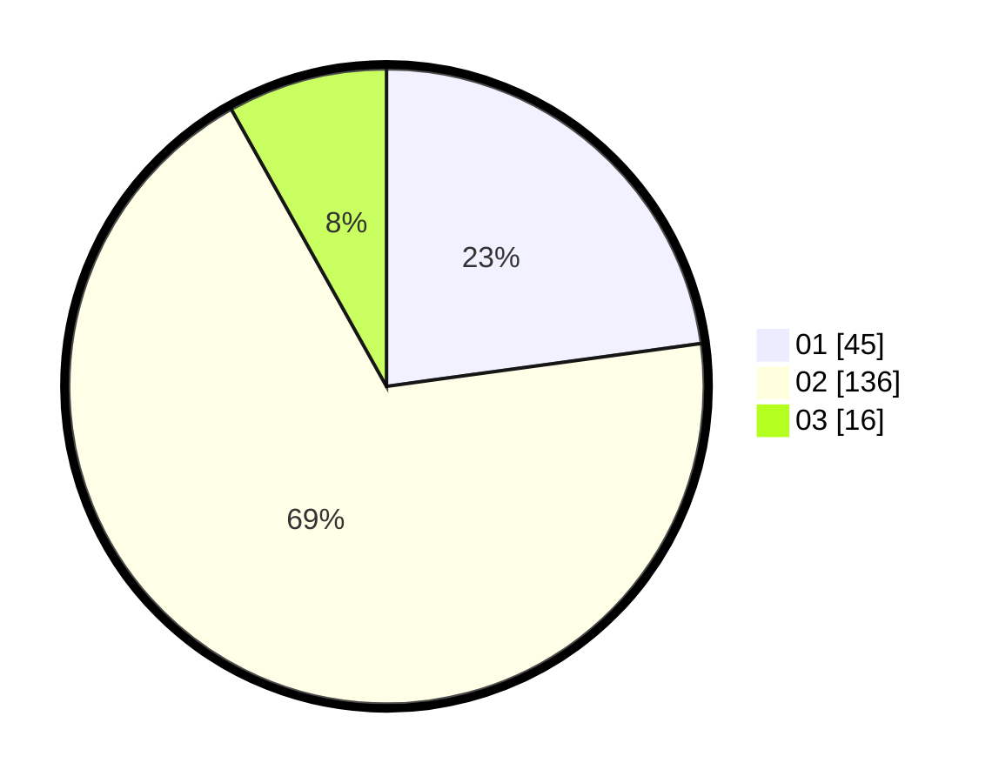

# Hasil

Hasil perolehan suara paslon dapat dilihat pada file paslon-01.txt, paslon-02.txt, dan paslon-03.txt.

Jika tidak ada, artinya data tersebut belum ada pada SIREKAP.

## Perolehan Suara

 * Paslon 01: **45**.
 * Paslon 02: **136**.
 * Paslon 03: **16**.

## Foto C Plano

https://sirekap-obj-formc.kpu.go.id/cfcc/pemilu/ppwp/31/73/06/10/03/3173061003248-20240215-215255--cb48a912-9043-452d-9e9a-8e9ec8b54675.jpg

https://sirekap-obj-formc.kpu.go.id/cfcc/pemilu/ppwp/31/73/06/10/03/3173061003248-20240215-215257--6acbfbb0-c1c8-4999-8eb9-a2b4c25899fc.jpg

https://sirekap-obj-formc.kpu.go.id/cfcc/pemilu/ppwp/31/73/06/10/03/3173061003248-20240215-215256--2b28c922-3941-4e29-a5cf-4093afe7a4d1.jpg

## DATA PEMILIH TETAP

Jumlah pemilih dalam DPT: **272**.
 * L: **142**.
 * P: **130**.

## DATA PENGGUNA HAK PILIH

Jumlah pengguna hak pilih dalam DPT: **199**.
 * L: **105**.
 * P: **94**.

Jumlah pengguna hak pilih dalam DPTb: **0**.
 * L: **0**.
 * P: **0**.

Jumlah pengguna hak pilih dalam DPK: **2**.
 * L: **0**.
 * P: **2**.

Jumlah pengguna hak pilih: **201**.
 * L: **105**.
 * P: **96**.

## JUMLAH SUARA SAH DAN TIDAK SAH

JUMLAH SELURUH SUARA SAH: **197**.

JUMLAH SUARA TIDAK SAH: **4**.

JUMLAH SELURUH SUARA SAH DAN SUARA TIDAK SAH: **201**.
