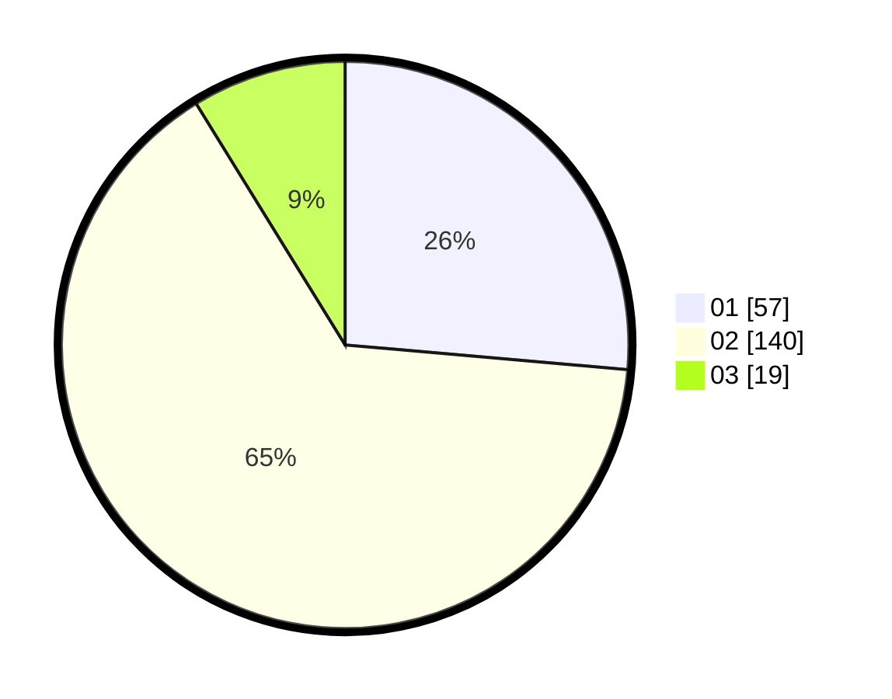

# Hasil

Hasil perolehan suara paslon dapat dilihat pada file paslon-01.txt, paslon-02.txt, dan paslon-03.txt.

Jika tidak ada, artinya data tersebut belum ada pada SIREKAP.

## Perolehan Suara

 * Paslon 01: **57**.
 * Paslon 02: **140**.
 * Paslon 03: **19**.

## Foto C Plano

https://sirekap-obj-formc.kpu.go.id/f805/pemilu/ppwp/31/73/06/10/03/3173061003250-20240214-192415--9731e9a0-fe76-4b41-aac4-016464f0a983.jpg

https://sirekap-obj-formc.kpu.go.id/f805/pemilu/ppwp/31/73/06/10/03/3173061003250-20240214-210317--9e15d9f4-316e-4249-8a7f-22f84fbbe392.jpg

https://sirekap-obj-formc.kpu.go.id/f805/pemilu/ppwp/31/73/06/10/03/3173061003250-20240214-182917--47f7eb49-5151-46bb-87bd-8e41246f9153.jpg

## DATA PEMILIH TETAP

Jumlah pemilih dalam DPT: **279**.
 * L: **144**.
 * P: **135**.

## DATA PENGGUNA HAK PILIH

Jumlah pengguna hak pilih dalam DPT: **223**.
 * L: **114**.
 * P: **109**.

Jumlah pengguna hak pilih dalam DPTb: **0**.
 * L: **0**.
 * P: **0**.

Jumlah pengguna hak pilih dalam DPK: **2**.
 * L: **2**.
 * P: **0**.

Jumlah pengguna hak pilih: **225**.
 * L: **116**.
 * P: **109**.

## JUMLAH SUARA SAH DAN TIDAK SAH

JUMLAH SELURUH SUARA SAH: **216**.

JUMLAH SUARA TIDAK SAH: **9**.

JUMLAH SELURUH SUARA SAH DAN SUARA TIDAK SAH: **225**.
