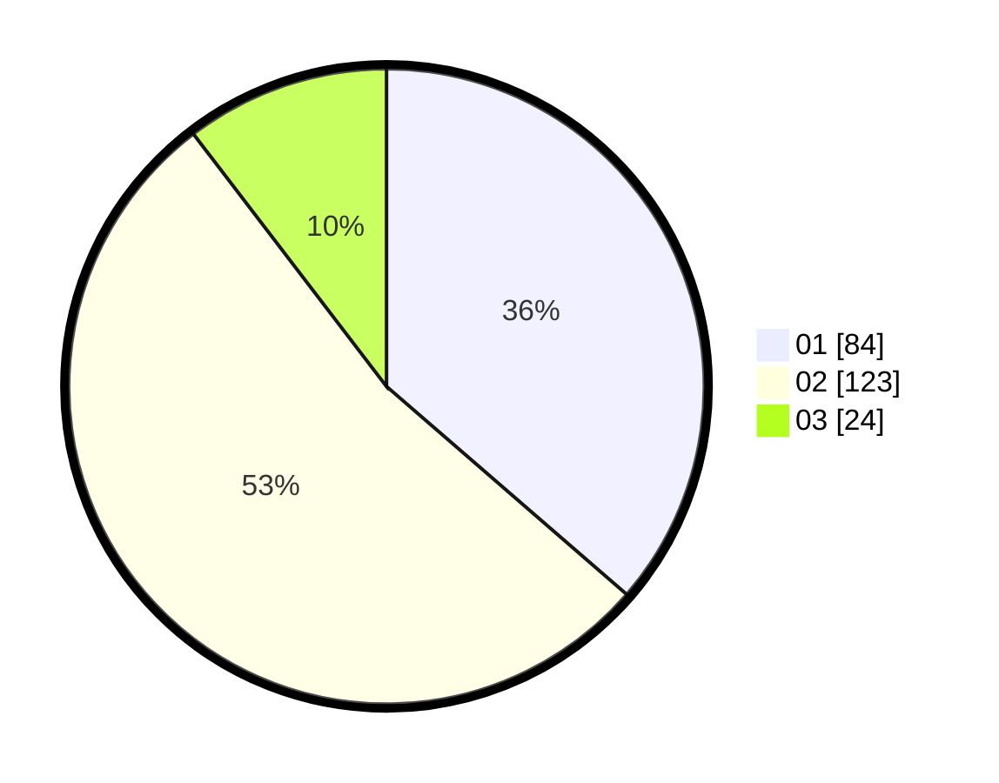

# Hasil

Hasil perolehan suara paslon dapat dilihat pada file paslon-01.txt, paslon-02.txt, dan paslon-03.txt.

Jika tidak ada, artinya data tersebut belum ada pada SIREKAP.

## Perolehan Suara

 * Paslon 01: **84**.
 * Paslon 02: **123**.
 * Paslon 03: **24**.

## Foto C Plano

https://sirekap-obj-formc.kpu.go.id/0447/pemilu/ppwp/31/73/06/10/03/3173061003253-20240214-211818--eaf91599-9196-4e12-99e0-bb5ca35bcdf3.jpg

https://sirekap-obj-formc.kpu.go.id/0447/pemilu/ppwp/31/73/06/10/03/3173061003253-20240214-211931--2d9e228d-60cb-4be2-a0bb-721e3a4c3eaa.jpg

https://sirekap-obj-formc.kpu.go.id/0447/pemilu/ppwp/31/73/06/10/03/3173061003253-20240214-211834--8a54cc9e-238a-4c3f-8835-a3e61c3f0f13.jpg
