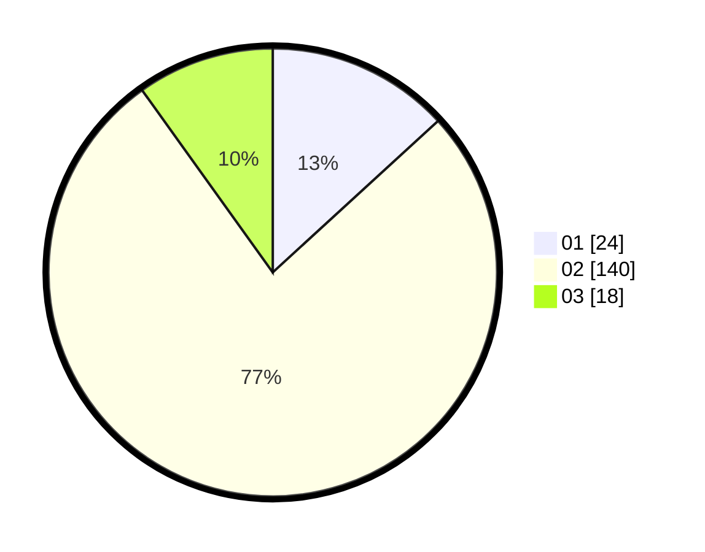

# Hasil

Hasil perolehan suara paslon dapat dilihat pada file paslon-01.txt, paslon-02.txt, dan paslon-03.txt.

Jika tidak ada, artinya data tersebut belum ada pada SIREKAP.

## Perolehan Suara

 * Paslon 01: **24**.
 * Paslon 02: **140**.
 * Paslon 03: **18**.

## Foto C Plano

https://sirekap-obj-formc.kpu.go.id/dd5c/pemilu/ppwp/31/73/06/10/03/3173061003254-20240214-194010--1a5ca57f-e884-4f54-9ed5-2328a241d24e.jpg

https://sirekap-obj-formc.kpu.go.id/dd5c/pemilu/ppwp/31/73/06/10/03/3173061003254-20240214-211245--4638c28c-502e-4e6e-a05d-6515f73b0a8a.jpg

https://sirekap-obj-formc.kpu.go.id/dd5c/pemilu/ppwp/31/73/06/10/03/3173061003254-20240214-205527--bccb05e0-9017-4c91-9dc1-51f7af03e817.jpg

## DATA PEMILIH TETAP

Jumlah pemilih dalam DPT: **243**.
 * L: **120**.
 * P: **123**.

## DATA PENGGUNA HAK PILIH

Jumlah pengguna hak pilih dalam DPT: **180**.
 * L: **94**.
 * P: **86**.

Jumlah pengguna hak pilih dalam DPTb: **0**.
 * L: **0**.
 * P: **0**.

Jumlah pengguna hak pilih dalam DPK: **4**.
 * L: **2**.
 * P: **2**.

Jumlah pengguna hak pilih: **184**.
 * L: **96**.
 * P: **88**.

## JUMLAH SUARA SAH DAN TIDAK SAH

JUMLAH SELURUH SUARA SAH: **182**.

JUMLAH SUARA TIDAK SAH: **2**.

JUMLAH SELURUH SUARA SAH DAN SUARA TIDAK SAH: **184**.
