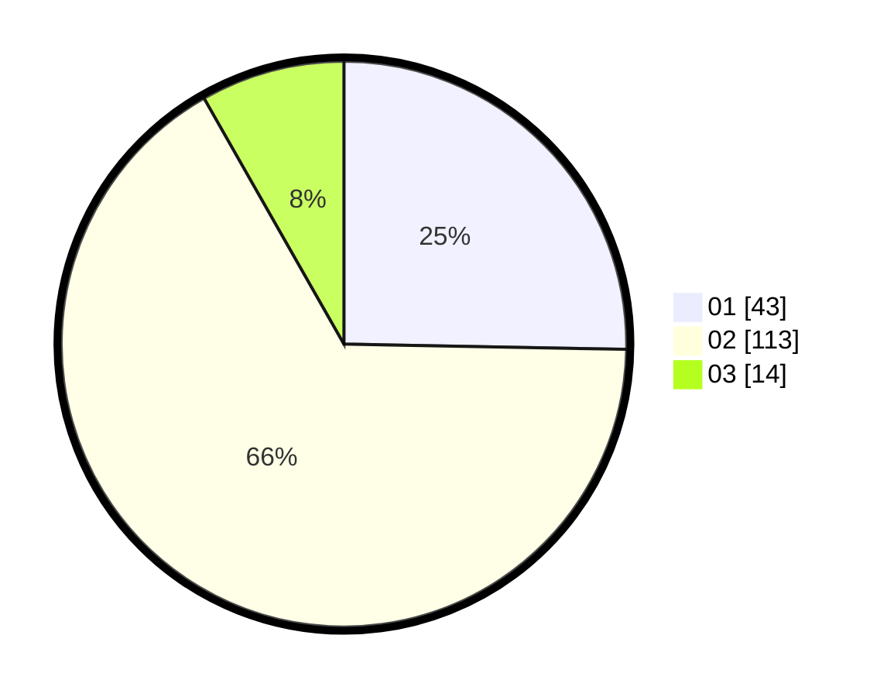

# Hasil

Hasil perolehan suara paslon dapat dilihat pada file paslon-01.txt, paslon-02.txt, dan paslon-03.txt.

Jika tidak ada, artinya data tersebut belum ada pada SIREKAP.

## Perolehan Suara

 * Paslon 01: **43**.
 * Paslon 02: **113**.
 * Paslon 03: **14**.

## Foto C Plano

https://sirekap-obj-formc.kpu.go.id/3356/pemilu/ppwp/31/73/06/10/03/3173061003255-20240216-114217--effd1cb3-aba2-4871-b369-8ec84f51bf12.jpg

https://sirekap-obj-formc.kpu.go.id/3356/pemilu/ppwp/31/73/06/10/03/3173061003255-20240216-114219--73a395a5-d97b-48bd-b132-9217c01058cf.jpg

https://sirekap-obj-formc.kpu.go.id/3356/pemilu/ppwp/31/73/06/10/03/3173061003255-20240216-114218--3d8bb06e-1b14-4926-b9fb-085feb12dfa6.jpg

## DATA PEMILIH TETAP

Jumlah pemilih dalam DPT: **246**.
 * L: **127**.
 * P: **119**.

## DATA PENGGUNA HAK PILIH

Jumlah pengguna hak pilih dalam DPT: **175**.
 * L: **89**.
 * P: **86**.

Jumlah pengguna hak pilih dalam DPTb: **0**.
 * L: **0**.
 * P: **0**.

Jumlah pengguna hak pilih dalam DPK: **0**.
 * L: **0**.
 * P: **0**.

Jumlah pengguna hak pilih: **175**.
 * L: **89**.
 * P: **86**.

## JUMLAH SUARA SAH DAN TIDAK SAH

JUMLAH SELURUH SUARA SAH: **170**.

JUMLAH SUARA TIDAK SAH: **5**.

JUMLAH SELURUH SUARA SAH DAN SUARA TIDAK SAH: **175**.
