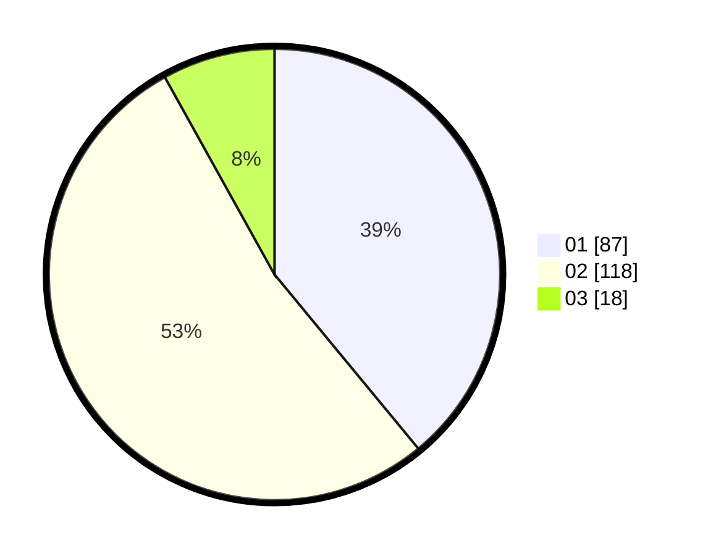

# Hasil

Hasil perolehan suara paslon dapat dilihat pada file paslon-01.txt, paslon-02.txt, dan paslon-03.txt.

Jika tidak ada, artinya data tersebut belum ada pada SIREKAP.

## Perolehan Suara

 * Paslon 01: **87**.
 * Paslon 02: **118**.
 * Paslon 03: **18**.

## Foto C Plano

https://sirekap-obj-formc.kpu.go.id/6f0c/pemilu/ppwp/31/73/06/10/03/3173061003258-20240215-205406--3f4c04ed-171a-45b5-a72d-dbfdca92de82.jpg

https://sirekap-obj-formc.kpu.go.id/6f0c/pemilu/ppwp/31/73/06/10/03/3173061003258-20240215-205409--0898a60a-3905-4000-828e-78473021997e.jpg

https://sirekap-obj-formc.kpu.go.id/6f0c/pemilu/ppwp/31/73/06/10/03/3173061003258-20240215-205408--60280a20-9f5d-43e0-b3ee-0ad66a9d2d55.jpg

## DATA PEMILIH TETAP

Jumlah pemilih dalam DPT: **258**.
 * L: **131**.
 * P: **127**.

## DATA PENGGUNA HAK PILIH

Jumlah pengguna hak pilih dalam DPT: **218**.
 * L: **105**.
 * P: **113**.

Jumlah pengguna hak pilih dalam DPTb: **0**.
 * L: **0**.
 * P: **0**.

Jumlah pengguna hak pilih dalam DPK: **7**.
 * L: **5**.
 * P: **2**.

Jumlah pengguna hak pilih: **225**.
 * L: **110**.
 * P: **115**.

## JUMLAH SUARA SAH DAN TIDAK SAH

JUMLAH SELURUH SUARA SAH: **223**.

JUMLAH SUARA TIDAK SAH: **2**.

JUMLAH SELURUH SUARA SAH DAN SUARA TIDAK SAH: **225**.
