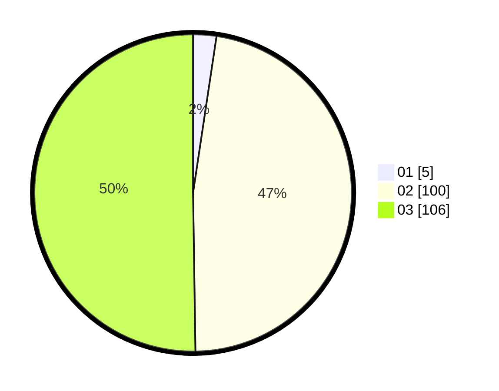

# Hasil

Hasil perolehan suara paslon dapat dilihat pada file paslon-01.txt, paslon-02.txt, dan paslon-03.txt.

Jika tidak ada, artinya data tersebut belum ada pada SIREKAP.

## Perolehan Suara

 * Paslon 01: **5**.
 * Paslon 02: **100**.
 * Paslon 03: **106**.

## Foto C Plano

https://sirekap-obj-formc.kpu.go.id/ada3/pemilu/ppwp/31/73/06/10/03/3173061003263-20240214-192931--f920abeb-480a-4384-bda4-5ae915faf7ac.jpg

https://sirekap-obj-formc.kpu.go.id/ada3/pemilu/ppwp/31/73/06/10/03/3173061003263-20240214-192936--f21f46a5-e0ba-4810-bf23-c4aea7d179c3.jpg

https://sirekap-obj-formc.kpu.go.id/ada3/pemilu/ppwp/31/73/06/10/03/3173061003263-20240214-192939--a8fb54d7-b56c-4e7a-8db0-b8186ffc57aa.jpg

## DATA PEMILIH TETAP

Jumlah pemilih dalam DPT: **278**.
 * L: **134**.
 * P: **144**.

## DATA PENGGUNA HAK PILIH

Jumlah pengguna hak pilih dalam DPT: **202**.
 * L: **97**.
 * P: **105**.

Jumlah pengguna hak pilih dalam DPTb: **3**.
 * L: **1**.
 * P: **2**.

Jumlah pengguna hak pilih dalam DPK: **6**.
 * L: **3**.
 * P: **3**.

Jumlah pengguna hak pilih: **211**.
 * L: **101**.
 * P: **110**.

## JUMLAH SUARA SAH DAN TIDAK SAH

JUMLAH SELURUH SUARA SAH: **211**.

JUMLAH SUARA TIDAK SAH: **0**.

JUMLAH SELURUH SUARA SAH DAN SUARA TIDAK SAH: **211**.
