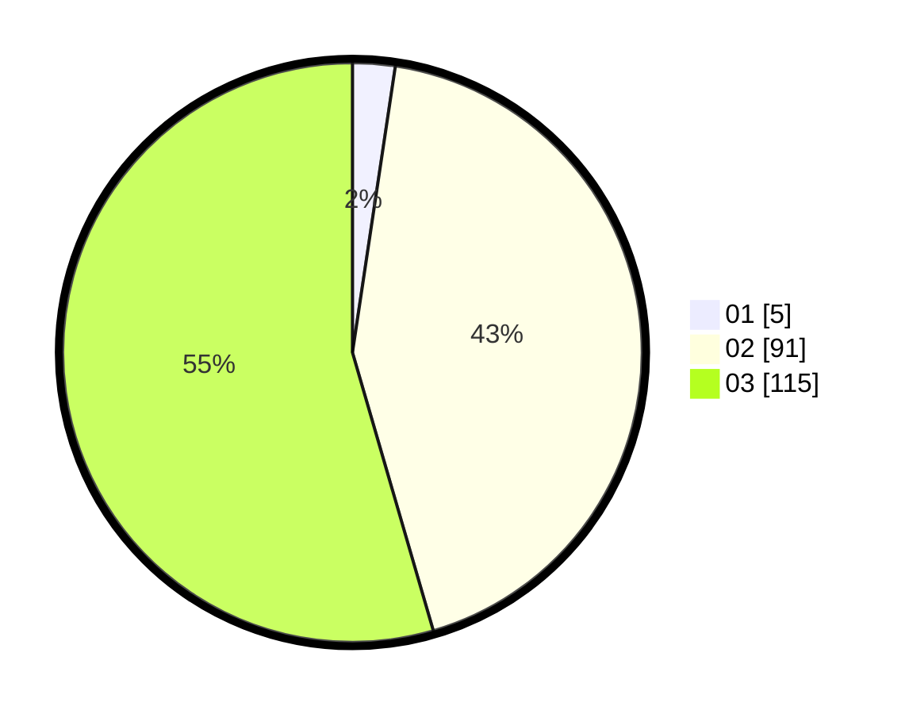

# Hasil

Hasil perolehan suara paslon dapat dilihat pada file paslon-01.txt, paslon-02.txt, dan paslon-03.txt.

Jika tidak ada, artinya data tersebut belum ada pada SIREKAP.

## Perolehan Suara

 * Paslon 01: **5**.
 * Paslon 02: **91**.
 * Paslon 03: **115**.

## Foto C Plano

https://sirekap-obj-formc.kpu.go.id/15df/pemilu/ppwp/31/73/06/10/03/3173061003266-20240214-215734--6c4166d4-ecf9-4469-96f4-8cb33319b84c.jpg

https://sirekap-obj-formc.kpu.go.id/15df/pemilu/ppwp/31/73/06/10/03/3173061003266-20240214-204333--58b881bd-63e4-4414-b8e8-a8ae99a3694d.jpg

https://sirekap-obj-formc.kpu.go.id/15df/pemilu/ppwp/31/73/06/10/03/3173061003266-20240214-204544--eb4ace42-81f2-4651-a240-173e77850ff5.jpg

## DATA PEMILIH TETAP

Jumlah pemilih dalam DPT: **262**.
 * L: **126**.
 * P: **136**.

## DATA PENGGUNA HAK PILIH

Jumlah pengguna hak pilih dalam DPT: **199**.
 * L: **95**.
 * P: **104**.

Jumlah pengguna hak pilih dalam DPTb: **6**.
 * L: **3**.
 * P: **3**.

Jumlah pengguna hak pilih dalam DPK: **8**.
 * L: **2**.
 * P: **6**.

Jumlah pengguna hak pilih: **213**.
 * L: **100**.
 * P: **113**.

## JUMLAH SUARA SAH DAN TIDAK SAH

JUMLAH SELURUH SUARA SAH: **211**.

JUMLAH SUARA TIDAK SAH: **2**.

JUMLAH SELURUH SUARA SAH DAN SUARA TIDAK SAH: **213**.
