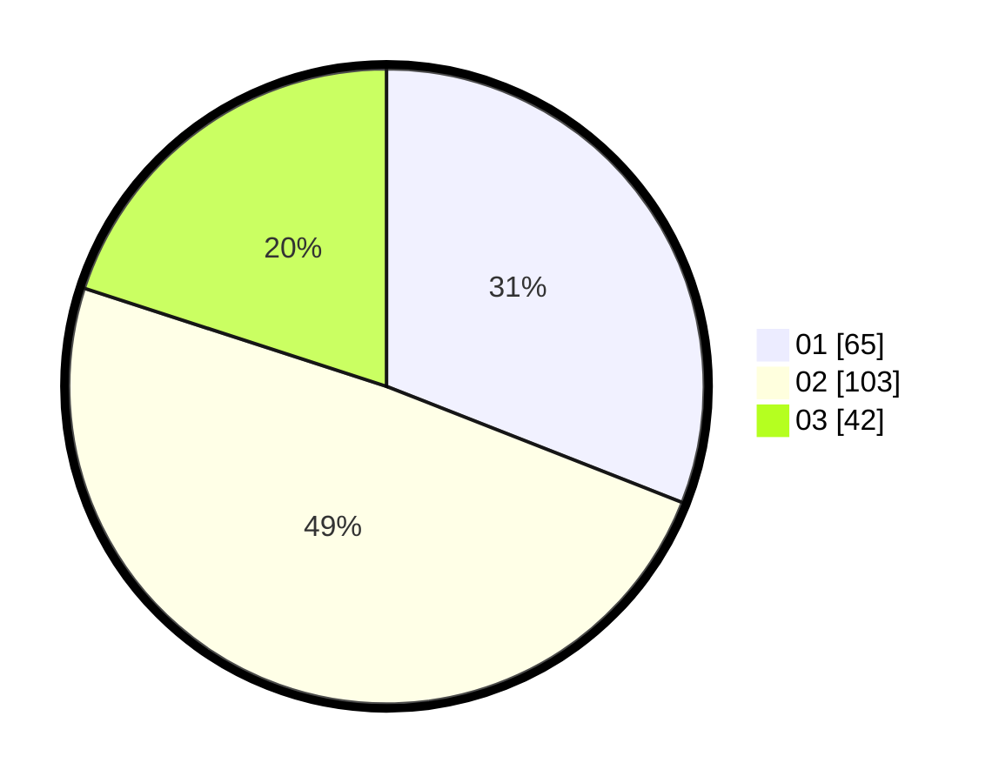

# Hasil

Hasil perolehan suara paslon dapat dilihat pada file paslon-01.txt, paslon-02.txt, dan paslon-03.txt.

Jika tidak ada, artinya data tersebut belum ada pada SIREKAP.

## Perolehan Suara

 * Paslon 01: **65**.
 * Paslon 02: **103**.
 * Paslon 03: **42**.

## Foto C Plano

https://sirekap-obj-formc.kpu.go.id/fac1/pemilu/ppwp/31/73/06/10/03/3173061003275-20240214-233006--41a1d4c8-5fb6-4d8f-b02c-1d4861c4d99f.jpg

https://sirekap-obj-formc.kpu.go.id/fac1/pemilu/ppwp/31/73/06/10/03/3173061003275-20240214-233051--895d34dd-aa5f-4525-8e1b-594bdb5a6cda.jpg

https://sirekap-obj-formc.kpu.go.id/fac1/pemilu/ppwp/31/73/06/10/03/3173061003275-20240214-233150--54739a1f-8333-42ff-a965-95a367295129.jpg
