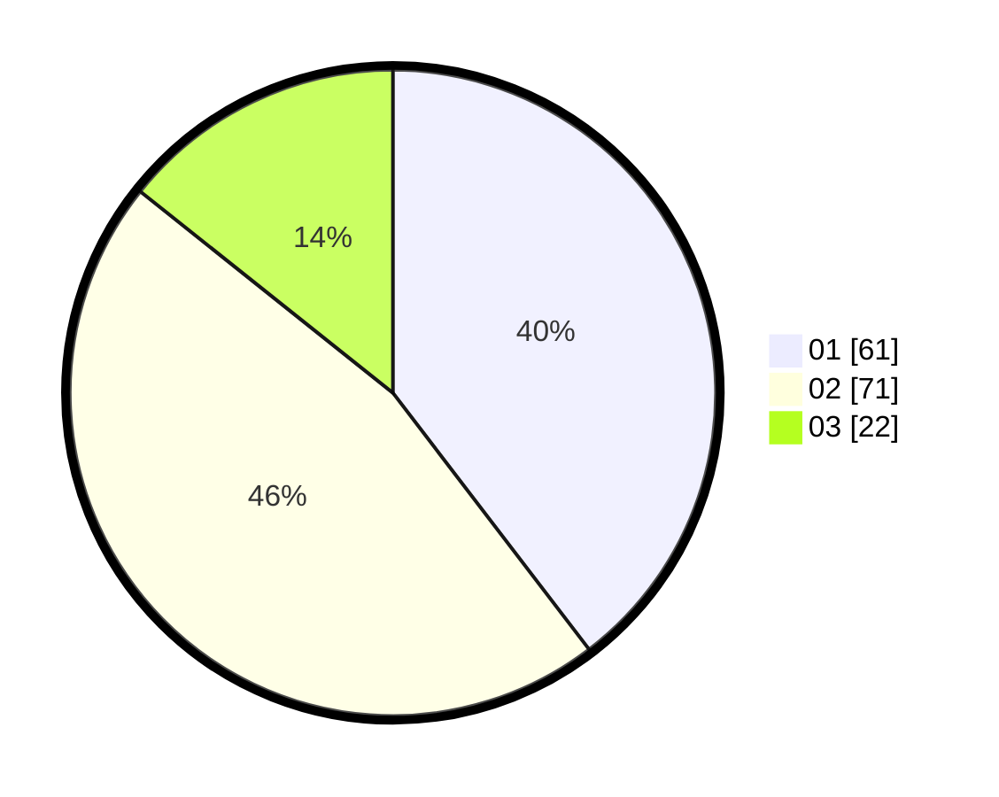

# Hasil

Hasil perolehan suara paslon dapat dilihat pada file paslon-01.txt, paslon-02.txt, dan paslon-03.txt.

Jika tidak ada, artinya data tersebut belum ada pada SIREKAP.

## Perolehan Suara

 * Paslon 01: **61**.
 * Paslon 02: **71**.
 * Paslon 03: **22**.

## Foto C Plano

https://sirekap-obj-formc.kpu.go.id/5bb9/pemilu/ppwp/31/73/06/10/03/3173061003281-20240215-051824--5c1227ec-0bd1-4b5f-b3ad-065ccd9edadf.jpg

https://sirekap-obj-formc.kpu.go.id/5bb9/pemilu/ppwp/31/73/06/10/03/3173061003281-20240215-051845--cebaa092-ac3a-44c8-9c8a-711ba29827d0.jpg

https://sirekap-obj-formc.kpu.go.id/5bb9/pemilu/ppwp/31/73/06/10/03/3173061003281-20240215-051834--874db883-8443-48a5-b224-e375d26aa6b1.jpg

## DATA PEMILIH TETAP

Jumlah pemilih dalam DPT: **211**.
 * L: **107**.
 * P: **104**.

## DATA PENGGUNA HAK PILIH

Jumlah pengguna hak pilih dalam DPT: **161**.
 * L: **75**.
 * P: **86**.

Jumlah pengguna hak pilih dalam DPTb: **0**.
 * L: **0**.
 * P: **0**.

Jumlah pengguna hak pilih dalam DPK: **0**.
 * L: **0**.
 * P: **0**.

Jumlah pengguna hak pilih: **161**.
 * L: **75**.
 * P: **86**.

## JUMLAH SUARA SAH DAN TIDAK SAH

JUMLAH SELURUH SUARA SAH: **154**.

JUMLAH SUARA TIDAK SAH: **7**.

JUMLAH SELURUH SUARA SAH DAN SUARA TIDAK SAH: **161**.
