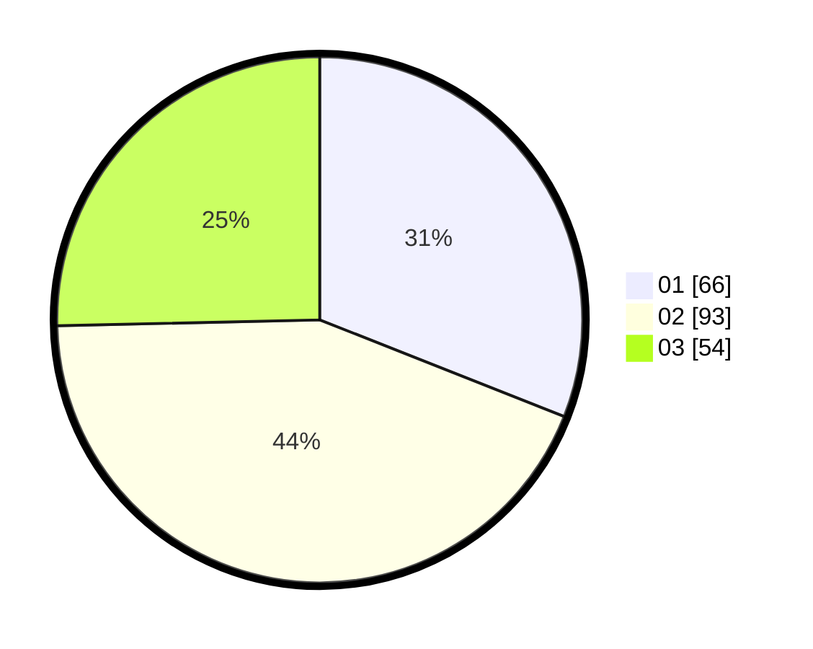

# Hasil

Hasil perolehan suara paslon dapat dilihat pada file paslon-01.txt, paslon-02.txt, dan paslon-03.txt.

Jika tidak ada, artinya data tersebut belum ada pada SIREKAP.

## Perolehan Suara

 * Paslon 01: **66**.
 * Paslon 02: **93**.
 * Paslon 03: **54**.

## Foto C Plano

https://sirekap-obj-formc.kpu.go.id/bef4/pemilu/ppwp/31/73/06/10/03/3173061003285-20240214-220552--de04ba0f-0887-49f0-88db-4da2d419ef79.jpg

https://sirekap-obj-formc.kpu.go.id/bef4/pemilu/ppwp/31/73/06/10/03/3173061003285-20240214-220728--be766796-d032-4e59-bc0c-a9808d1ef6b1.jpg

https://sirekap-obj-formc.kpu.go.id/bef4/pemilu/ppwp/31/73/06/10/03/3173061003285-20240214-221029--20c2777f-11a9-4585-aae3-8f3fe646b650.jpg
