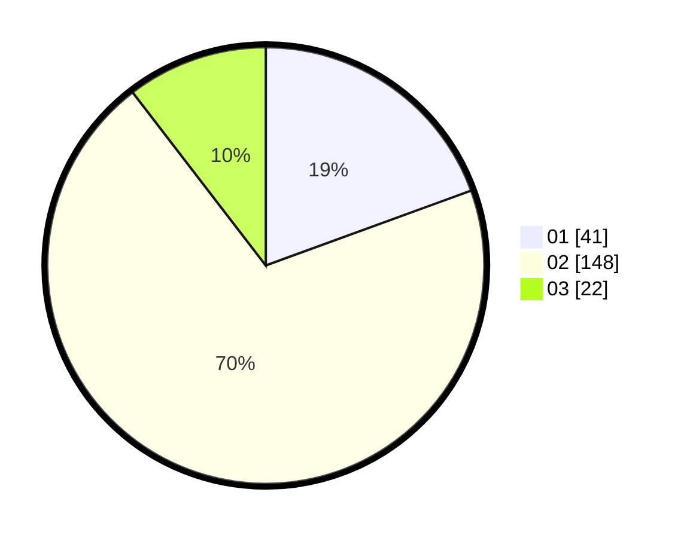

# Hasil

Hasil perolehan suara paslon dapat dilihat pada file paslon-01.txt, paslon-02.txt, dan paslon-03.txt.

Jika tidak ada, artinya data tersebut belum ada pada SIREKAP.

## Perolehan Suara

 * Paslon 01: **41**.
 * Paslon 02: **148**.
 * Paslon 03: **22**.

## Foto C Plano

https://sirekap-obj-formc.kpu.go.id/6f09/pemilu/ppwp/31/73/06/10/03/3173061003286-20240214-223854--674e3178-7fff-4932-9190-d1e4a1bae478.jpg

https://sirekap-obj-formc.kpu.go.id/6f09/pemilu/ppwp/31/73/06/10/03/3173061003286-20240214-224719--0a349a31-5700-4a06-be7d-3ac940b1dfab.jpg

https://sirekap-obj-formc.kpu.go.id/6f09/pemilu/ppwp/31/73/06/10/03/3173061003286-20240214-224925--66208591-f5db-4a9d-8da4-ea983ebf6b84.jpg
