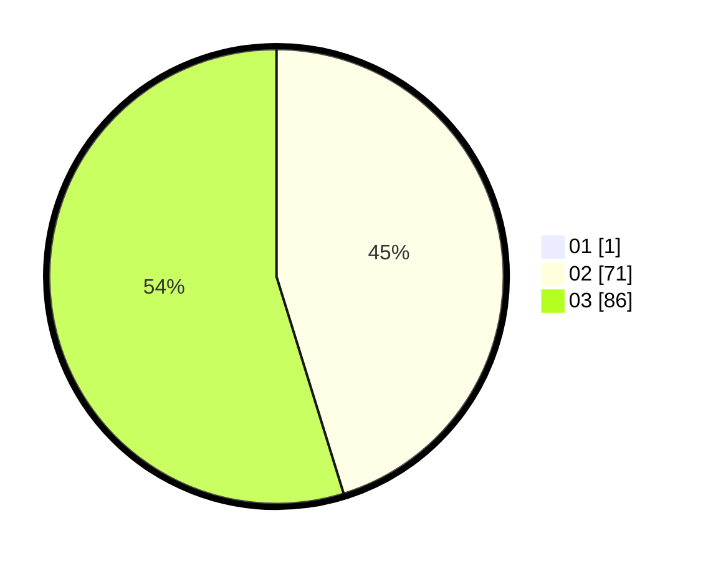

# Hasil

Hasil perolehan suara paslon dapat dilihat pada file paslon-01.txt, paslon-02.txt, dan paslon-03.txt.

Jika tidak ada, artinya data tersebut belum ada pada SIREKAP.

## Perolehan Suara

 * Paslon 01: **1**.
 * Paslon 02: **71**.
 * Paslon 03: **86**.

## Foto C Plano

https://sirekap-obj-formc.kpu.go.id/455b/pemilu/ppwp/31/73/06/10/03/3173061003288-20240214-201307--41282b81-c81e-466e-9af1-05161f00f4d8.jpg

https://sirekap-obj-formc.kpu.go.id/455b/pemilu/ppwp/31/73/06/10/03/3173061003288-20240214-201538--7eb4d2a8-8a56-4a35-b307-5cb1f9d9eb75.jpg

https://sirekap-obj-formc.kpu.go.id/455b/pemilu/ppwp/31/73/06/10/03/3173061003288-20240214-201652--9b79ae18-497a-4ccb-a31a-d7bc05cdf843.jpg

## DATA PEMILIH TETAP

Jumlah pemilih dalam DPT: **206**.
 * L: **103**.
 * P: **103**.

## DATA PENGGUNA HAK PILIH

Jumlah pengguna hak pilih dalam DPT: **156**.
 * L: **78**.
 * P: **78**.

Jumlah pengguna hak pilih dalam DPTb: **1**.
 * L: **0**.
 * P: **1**.

Jumlah pengguna hak pilih dalam DPK: **2**.
 * L: **0**.
 * P: **2**.

Jumlah pengguna hak pilih: **159**.
 * L: **78**.
 * P: **81**.

## JUMLAH SUARA SAH DAN TIDAK SAH

JUMLAH SELURUH SUARA SAH: **158**.

JUMLAH SUARA TIDAK SAH: **1**.

JUMLAH SELURUH SUARA SAH DAN SUARA TIDAK SAH: **159**.
