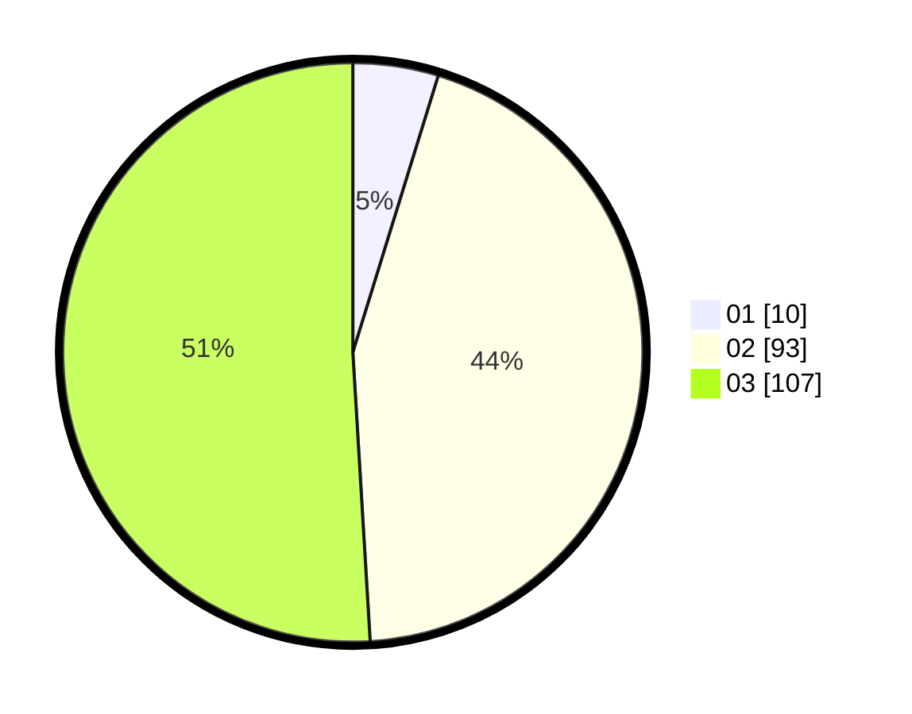

# Hasil

Hasil perolehan suara paslon dapat dilihat pada file paslon-01.txt, paslon-02.txt, dan paslon-03.txt.

Jika tidak ada, artinya data tersebut belum ada pada SIREKAP.

## Perolehan Suara

 * Paslon 01: **10**.
 * Paslon 02: **93**.
 * Paslon 03: **107**.

## Foto C Plano

https://sirekap-obj-formc.kpu.go.id/e8fd/pemilu/ppwp/31/73/06/10/03/3173061003289-20240214-192422--491983ee-ada3-4697-b30d-66b64438b253.jpg

https://sirekap-obj-formc.kpu.go.id/e8fd/pemilu/ppwp/31/73/06/10/03/3173061003289-20240214-185451--51895ff3-5e4c-4204-b1db-d972a77393b8.jpg

https://sirekap-obj-formc.kpu.go.id/e8fd/pemilu/ppwp/31/73/06/10/03/3173061003289-20240214-185523--563750cc-58d0-483e-bf90-92381b427efc.jpg

## DATA PEMILIH TETAP

Jumlah pemilih dalam DPT: **281**.
 * L: **130**.
 * P: **151**.

## DATA PENGGUNA HAK PILIH

Jumlah pengguna hak pilih dalam DPT: **209**.
 * L: **92**.
 * P: **117**.

Jumlah pengguna hak pilih dalam DPTb: **0**.
 * L: **0**.
 * P: **0**.

Jumlah pengguna hak pilih dalam DPK: **3**.
 * L: **0**.
 * P: **3**.

Jumlah pengguna hak pilih: **212**.
 * L: **92**.
 * P: **120**.

## JUMLAH SUARA SAH DAN TIDAK SAH

JUMLAH SELURUH SUARA SAH: **210**.

JUMLAH SUARA TIDAK SAH: **2**.

JUMLAH SELURUH SUARA SAH DAN SUARA TIDAK SAH: **212**.
