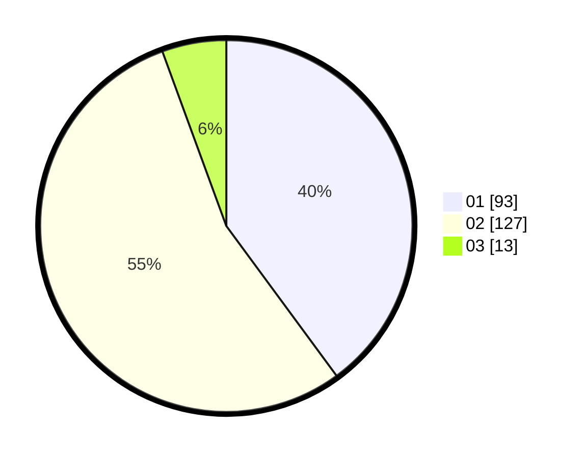

# Hasil

Hasil perolehan suara paslon dapat dilihat pada file paslon-01.txt, paslon-02.txt, dan paslon-03.txt.

Jika tidak ada, artinya data tersebut belum ada pada SIREKAP.

## Perolehan Suara

 * Paslon 01: **93**.
 * Paslon 02: **127**.
 * Paslon 03: **13**.

## Foto C Plano

https://sirekap-obj-formc.kpu.go.id/2239/pemilu/ppwp/31/73/06/10/04/3173061004002-20240216-120835--037d996c-e582-49a3-a8b9-f712682bc5c4.jpg

https://sirekap-obj-formc.kpu.go.id/2239/pemilu/ppwp/31/73/06/10/04/3173061004002-20240216-120837--b57903b5-5a0c-478c-b45b-7e2942cbb6a2.jpg

https://sirekap-obj-formc.kpu.go.id/2239/pemilu/ppwp/31/73/06/10/04/3173061004002-20240216-120836--d6009dd5-a2ed-4794-85fd-e14bf5df46a8.jpg

## DATA PEMILIH TETAP

Jumlah pemilih dalam DPT: **288**.
 * L: **159**.
 * P: **129**.

## DATA PENGGUNA HAK PILIH

Jumlah pengguna hak pilih dalam DPT: **240**.
 * L: **136**.
 * P: **104**.

Jumlah pengguna hak pilih dalam DPTb: **0**.
 * L: **0**.
 * P: **0**.

Jumlah pengguna hak pilih dalam DPK: **1**.
 * L: **0**.
 * P: **1**.

Jumlah pengguna hak pilih: **241**.
 * L: **136**.
 * P: **105**.

## JUMLAH SUARA SAH DAN TIDAK SAH

JUMLAH SELURUH SUARA SAH: **233**.

JUMLAH SUARA TIDAK SAH: **8**.

JUMLAH SELURUH SUARA SAH DAN SUARA TIDAK SAH: **241**.
