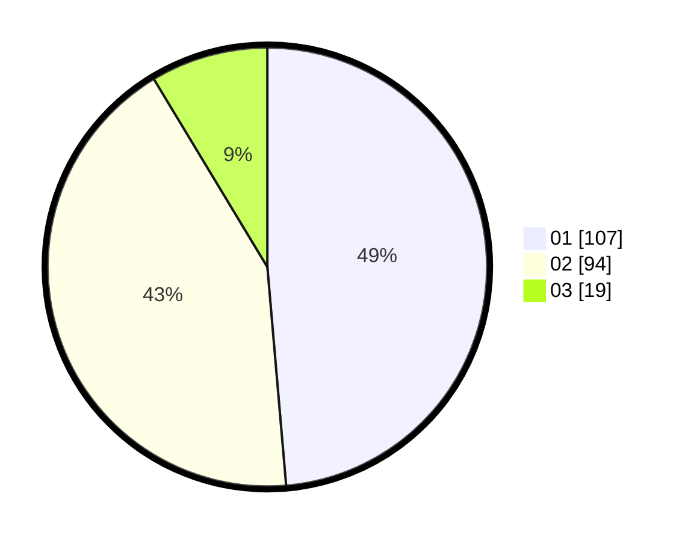

# Hasil

Hasil perolehan suara paslon dapat dilihat pada file paslon-01.txt, paslon-02.txt, dan paslon-03.txt.

Jika tidak ada, artinya data tersebut belum ada pada SIREKAP.

## Perolehan Suara

 * Paslon 01: **107**.
 * Paslon 02: **94**.
 * Paslon 03: **19**.

## Foto C Plano

https://sirekap-obj-formc.kpu.go.id/01c6/pemilu/ppwp/31/73/06/10/04/3173061004011-20240214-234242--ee9ee54f-e136-4d15-94f6-c36c975af18a.jpg

https://sirekap-obj-formc.kpu.go.id/01c6/pemilu/ppwp/31/73/06/10/04/3173061004011-20240214-234307--ac003ce5-a7e7-4bd2-9a40-666cd325e049.jpg

https://sirekap-obj-formc.kpu.go.id/01c6/pemilu/ppwp/31/73/06/10/04/3173061004011-20240214-234332--a822f4f9-d073-4b90-99bf-038d534761b4.jpg
