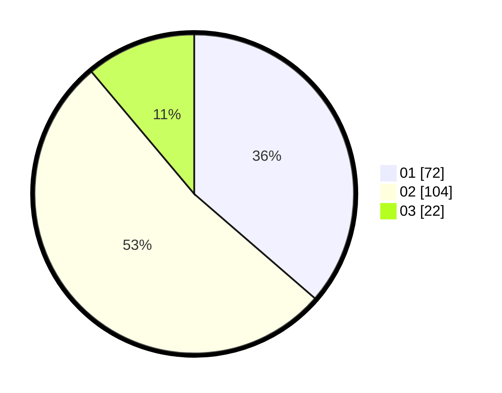

# Hasil

Hasil perolehan suara paslon dapat dilihat pada file paslon-01.txt, paslon-02.txt, dan paslon-03.txt.

Jika tidak ada, artinya data tersebut belum ada pada SIREKAP.

## Perolehan Suara

 * Paslon 01: **72**.
 * Paslon 02: **104**.
 * Paslon 03: **22**.

## Foto C Plano

https://sirekap-obj-formc.kpu.go.id/d435/pemilu/ppwp/31/73/06/10/04/3173061004012-20240216-144701--71e90bc7-d3aa-4af9-9c1f-85fb8594d13c.jpg

https://sirekap-obj-formc.kpu.go.id/d435/pemilu/ppwp/31/73/06/10/04/3173061004012-20240216-144702--7a797b54-6434-4a6d-934a-9cd27fea8299.jpg

https://sirekap-obj-formc.kpu.go.id/d435/pemilu/ppwp/31/73/06/10/04/3173061004012-20240216-144701--d8a88db1-252f-4af3-82e0-308f37efeb1b.jpg

## DATA PEMILIH TETAP

Jumlah pemilih dalam DPT: **287**.
 * L: **148**.
 * P: **139**.

## DATA PENGGUNA HAK PILIH

Jumlah pengguna hak pilih dalam DPT: **196**.
 * L: **98**.
 * P: **98**.

Jumlah pengguna hak pilih dalam DPTb: **0**.
 * L: **0**.
 * P: **0**.

Jumlah pengguna hak pilih dalam DPK: **3**.
 * L: **3**.
 * P: **0**.

Jumlah pengguna hak pilih: **199**.
 * L: **101**.
 * P: **98**.

## JUMLAH SUARA SAH DAN TIDAK SAH

JUMLAH SELURUH SUARA SAH: **198**.

JUMLAH SUARA TIDAK SAH: **2**.

JUMLAH SELURUH SUARA SAH DAN SUARA TIDAK SAH: **200**.
