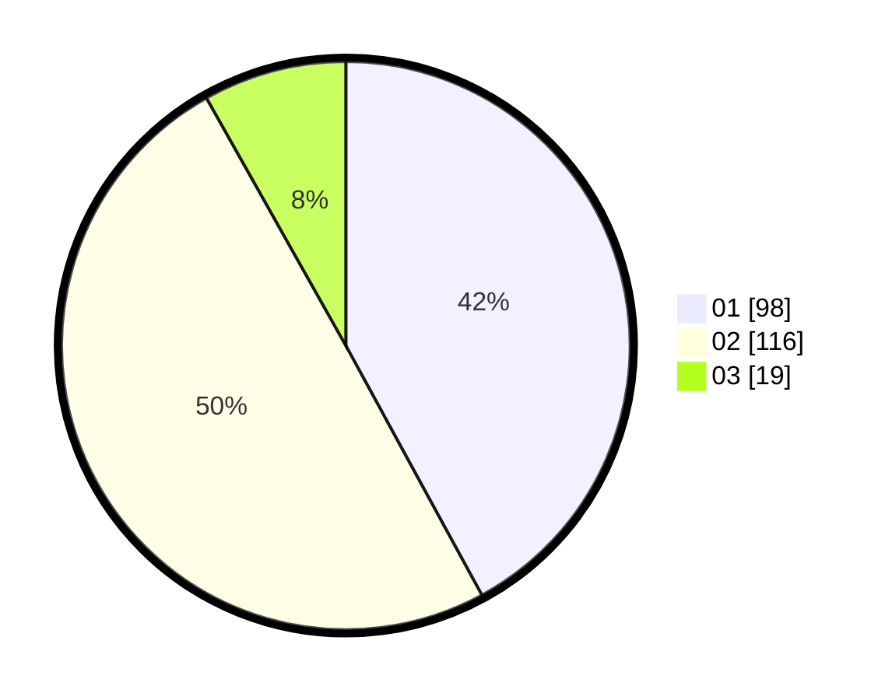

# Hasil

Hasil perolehan suara paslon dapat dilihat pada file paslon-01.txt, paslon-02.txt, dan paslon-03.txt.

Jika tidak ada, artinya data tersebut belum ada pada SIREKAP.

## Perolehan Suara

 * Paslon 01: **98**.
 * Paslon 02: **116**.
 * Paslon 03: **19**.

## Foto C Plano

https://sirekap-obj-formc.kpu.go.id/adc5/pemilu/ppwp/31/73/06/10/04/3173061004013-20240214-235014--a184e335-92d6-4d6a-8648-7092892d34ef.jpg

https://sirekap-obj-formc.kpu.go.id/adc5/pemilu/ppwp/31/73/06/10/04/3173061004013-20240214-235113--bfc6fc82-6d56-4272-8964-0290253d6493.jpg

https://sirekap-obj-formc.kpu.go.id/adc5/pemilu/ppwp/31/73/06/10/04/3173061004013-20240214-235111--df2c0b6f-db7e-40c7-b4f1-27acca3e27a7.jpg

## DATA PEMILIH TETAP

Jumlah pemilih dalam DPT: **287**.
 * L: **152**.
 * P: **135**.

## DATA PENGGUNA HAK PILIH

Jumlah pengguna hak pilih dalam DPT: **221**.
 * L: **110**.
 * P: **111**.

Jumlah pengguna hak pilih dalam DPTb: **6**.
 * L: **3**.
 * P: **3**.

Jumlah pengguna hak pilih dalam DPK: **10**.
 * L: **5**.
 * P: **5**.

Jumlah pengguna hak pilih: **237**.
 * L: **118**.
 * P: **119**.

## JUMLAH SUARA SAH DAN TIDAK SAH

JUMLAH SELURUH SUARA SAH: **233**.

JUMLAH SUARA TIDAK SAH: **4**.

JUMLAH SELURUH SUARA SAH DAN SUARA TIDAK SAH: **237**.
