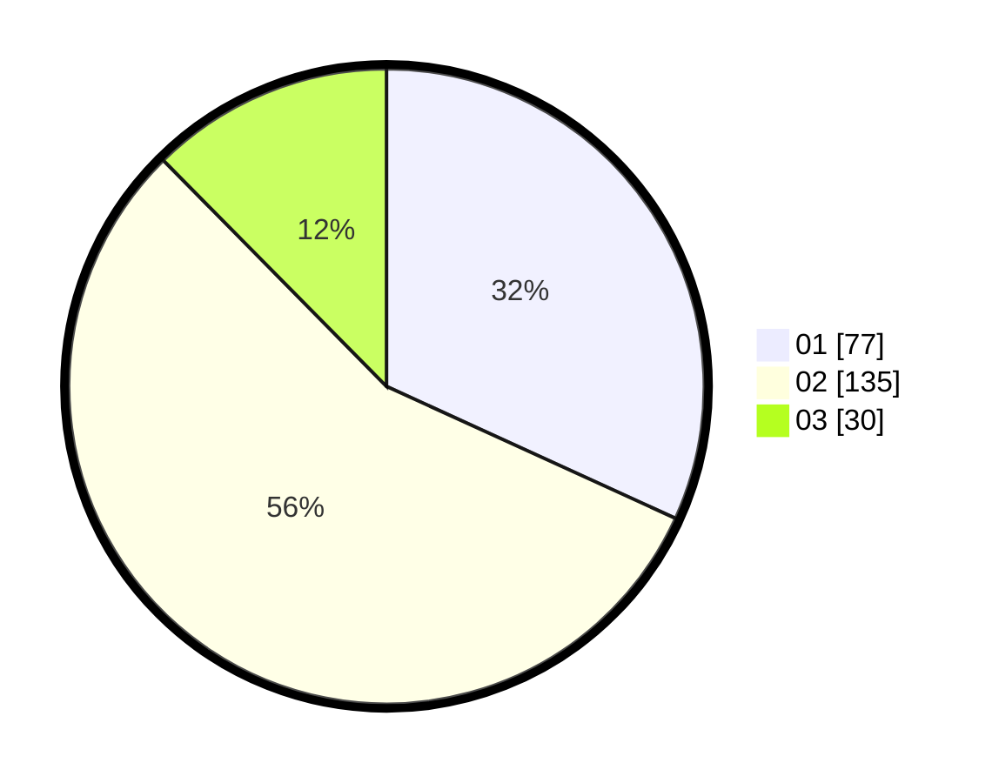

# Hasil

Hasil perolehan suara paslon dapat dilihat pada file paslon-01.txt, paslon-02.txt, dan paslon-03.txt.

Jika tidak ada, artinya data tersebut belum ada pada SIREKAP.

## Perolehan Suara

 * Paslon 01: **77**.
 * Paslon 02: **135**.
 * Paslon 03: **30**.

## Foto C Plano

https://sirekap-obj-formc.kpu.go.id/d12c/pemilu/ppwp/31/73/06/10/04/3173061004016-20240216-051654--f27b0571-c93a-48ea-9d5c-2474eabc1348.jpg

https://sirekap-obj-formc.kpu.go.id/d12c/pemilu/ppwp/31/73/06/10/04/3173061004016-20240216-051655--719a16d8-dc28-45c1-95e4-f53915cb6b2b.jpg

https://sirekap-obj-formc.kpu.go.id/d12c/pemilu/ppwp/31/73/06/10/04/3173061004016-20240216-051654--c8d6a8bf-6833-4961-b16f-96a8112dec80.jpg

## DATA PEMILIH TETAP

Jumlah pemilih dalam DPT: **288**.
 * L: **148**.
 * P: **140**.

## DATA PENGGUNA HAK PILIH

Jumlah pengguna hak pilih dalam DPT: **243**.
 * L: **120**.
 * P: **123**.

Jumlah pengguna hak pilih dalam DPTb: **0**.
 * L: **0**.
 * P: **0**.

Jumlah pengguna hak pilih dalam DPK: **2**.
 * L: **0**.
 * P: **2**.

Jumlah pengguna hak pilih: **245**.
 * L: **120**.
 * P: **125**.

## JUMLAH SUARA SAH DAN TIDAK SAH

JUMLAH SELURUH SUARA SAH: **242**.

JUMLAH SUARA TIDAK SAH: **3**.

JUMLAH SELURUH SUARA SAH DAN SUARA TIDAK SAH: **245**.
