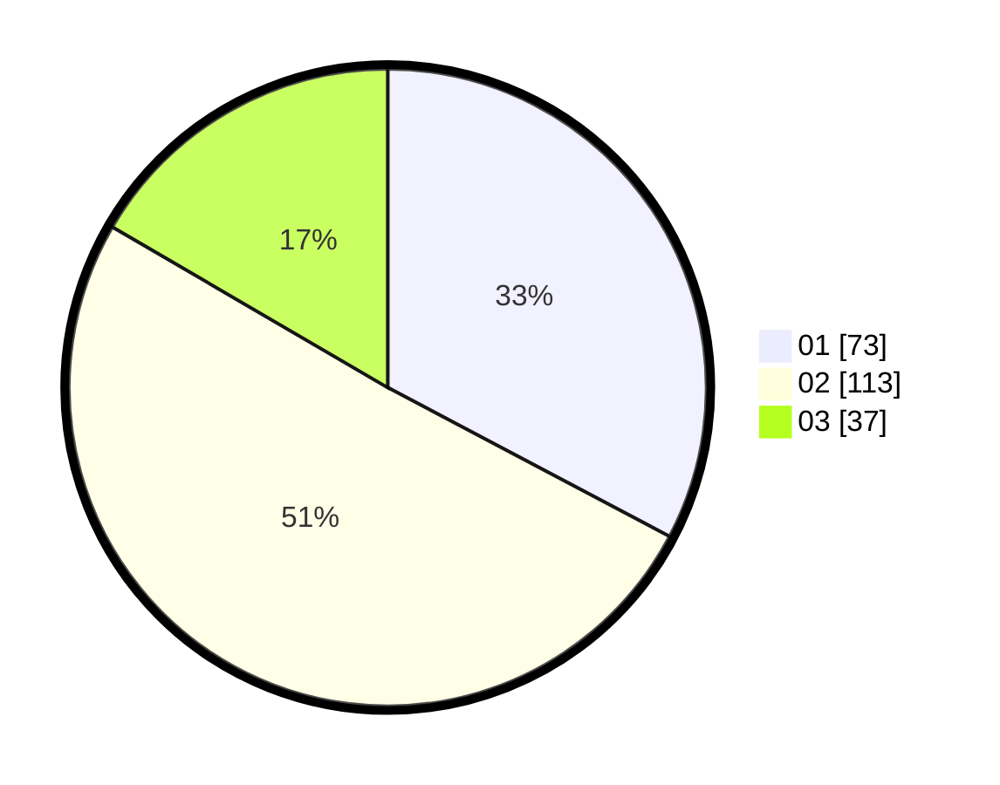

# Hasil

Hasil perolehan suara paslon dapat dilihat pada file paslon-01.txt, paslon-02.txt, dan paslon-03.txt.

Jika tidak ada, artinya data tersebut belum ada pada SIREKAP.

## Perolehan Suara

 * Paslon 01: **73**.
 * Paslon 02: **113**.
 * Paslon 03: **37**.

## Foto C Plano

https://sirekap-obj-formc.kpu.go.id/1713/pemilu/ppwp/31/73/06/10/04/3173061004018-20240216-043500--28e49553-fbba-4d84-85c8-7801a260dc88.jpg

https://sirekap-obj-formc.kpu.go.id/1713/pemilu/ppwp/31/73/06/10/04/3173061004018-20240216-043501--a4881fe7-ec64-433a-8058-6e9e446fbf64.jpg

https://sirekap-obj-formc.kpu.go.id/1713/pemilu/ppwp/31/73/06/10/04/3173061004018-20240216-043501--33d305b3-d29e-48a8-8a30-dd86e1103a9e.jpg

## DATA PEMILIH TETAP

Jumlah pemilih dalam DPT: **286**.
 * L: **137**.
 * P: **149**.

## DATA PENGGUNA HAK PILIH

Jumlah pengguna hak pilih dalam DPT: **233**.
 * L: **108**.
 * P: **125**.

Jumlah pengguna hak pilih dalam DPTb: **0**.
 * L: **0**.
 * P: **0**.

Jumlah pengguna hak pilih dalam DPK: **2**.
 * L: **1**.
 * P: **1**.

Jumlah pengguna hak pilih: **235**.
 * L: **109**.
 * P: **126**.

## JUMLAH SUARA SAH DAN TIDAK SAH

JUMLAH SELURUH SUARA SAH: **229**.

JUMLAH SUARA TIDAK SAH: **4**.

JUMLAH SELURUH SUARA SAH DAN SUARA TIDAK SAH: **233**.
