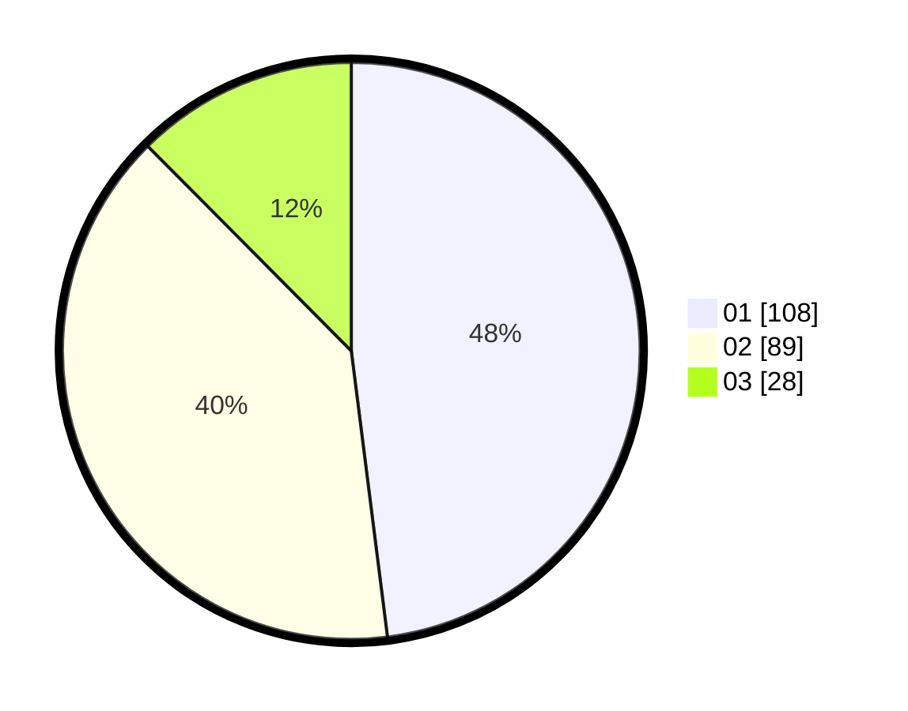

# Hasil

Hasil perolehan suara paslon dapat dilihat pada file paslon-01.txt, paslon-02.txt, dan paslon-03.txt.

Jika tidak ada, artinya data tersebut belum ada pada SIREKAP.

## Perolehan Suara

 * Paslon 01: **108**.
 * Paslon 02: **89**.
 * Paslon 03: **28**.

## Foto C Plano

https://sirekap-obj-formc.kpu.go.id/22b3/pemilu/ppwp/31/73/06/10/04/3173061004022-20240216-004624--7a99d203-c422-4edd-8d2d-7f6cbb458c7a.jpg

https://sirekap-obj-formc.kpu.go.id/22b3/pemilu/ppwp/31/73/06/10/04/3173061004022-20240216-004635--282ad75c-8b2d-40dd-b414-b879f7d25de3.jpg

https://sirekap-obj-formc.kpu.go.id/22b3/pemilu/ppwp/31/73/06/10/04/3173061004022-20240216-004630--98401708-46e6-45dd-bebe-1741c1e34083.jpg

## DATA PEMILIH TETAP

Jumlah pemilih dalam DPT: **0**.
 * L: **0**.
 * P: **0**.

## DATA PENGGUNA HAK PILIH

Jumlah pengguna hak pilih dalam DPT: **226**.
 * L: **108**.
 * P: **118**.

Jumlah pengguna hak pilih dalam DPTb: **3**.
 * L: **1**.
 * P: **2**.

Jumlah pengguna hak pilih dalam DPK: **0**.
 * L: **0**.
 * P: **0**.

Jumlah pengguna hak pilih: **229**.
 * L: **109**.
 * P: **120**.

## JUMLAH SUARA SAH DAN TIDAK SAH

JUMLAH SELURUH SUARA SAH: **225**.

JUMLAH SUARA TIDAK SAH: **4**.

JUMLAH SELURUH SUARA SAH DAN SUARA TIDAK SAH: **229**.
